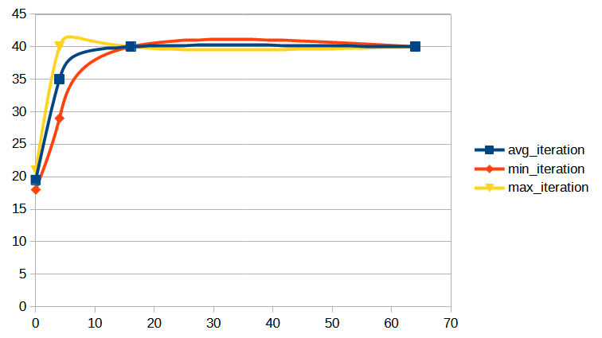

# Tabou
 
## Choix des opérateurs 

Il ne faut pas que les opérateurs se superposent
Besoin d'un opérateur qui permet de supprimer un camion : le relocate
## Détection de schéma

**Mettre capture d'écran d'un schéma qui se répète**
Une fois le développement de la liste tabu achevé, nous avons remarqué que dans la quasi totalité de nos premiers tests, nous pouvions visuellement voir une répetition de fitness. Cette répetition arrivait assez rapidement et nous avons donc penser qu'il serait utile de réaliser une détection de schéma afin d'éviter un grand nombre d'itération inutile

### Développement

Pour réaliser cette détection, nous avons d'abord décider du système suivant :
une liste contient des dictionnaire, qui eux même stockent en clé la fitness et en valeur la liste tabou converti en chaîne de charactère. L'idée derrière ce système était que si nous revenions à la même fitness avec la même liste tabou, alors nous somme dans le même état que le début du cycle, et donc que nous allons tourner en boucle. Toute cette idée repose sur le fait que la fitness est unique pour chaque solution. Or, nous nous somme rendu compte que ce n'était pas le cas et que deux solutions pouvaient avoir la même fitness. Ainsi, nous avons donc développer une fonctione de hashage de la solution qui nous permet d'avoir une clé réellement unique et de rendre cette détection de schéma fonctionnel

### Analyse des résultats liés

Cette fonctionnalité nous a ammené à la métrique suivante : le nombre d'itération réel (en opposition avec le nombre d'itération prévu au départ)

#### Analyse sur les version short (30 premiers clients)

Nous pouvons remarqué un fait intéressant sur cette donnée. Prennons par exemple le fichier output_data101_short.csv. Dans ce fichier, nous remarquons d'abord que pour le hill climbing (càd taille tabu = 0), le nombre de ligne effective est globalement toujours le même, et toujours inférieur au nombre d'itération prévu (environ 18 itérations réels). Cela est assez simplement interpretable : le hill climbing converge toujours en un nombre d'itération similaire sur ce jeu de données. Ainsi, nous pouvons déduire que le bon hyperparamètre pour le hill climbing est de 18 itérations.
TODO : il faudrait plutot analyser le fichier de moyenne pour cela

Pour revenir au tabou,
