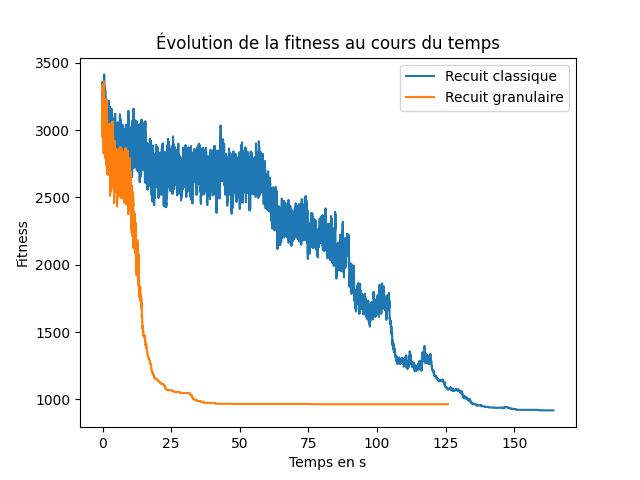

# Rapport VRPTW Optimisation Discrète

GURUPHAT Nicolas & MOUTOTE Grégory

## Introduction

Le problème de routage de véhicules avec fenêtres de temps (VRPTW) est un problème bien connu en optimisation combinatoire, il consiste à trouver le ou ou les meilleurs chemins pour livrer des clients en établissant un ensemble de routes composées de camions. Même s'il existe bien des variantes de ce problème, il est dans tous les cas difficile de lui trouver une solution optimale dans un temps raisonnable. C'est dans ce cadre que sont utilisées des métaheuristiques pour trouver une bonne solution le plus rapidement possible, sans forcément trouver un résultat optimal. Dans la suite, nous aborderons deux métaheuristiques, le Tabou et le Recuit Simulé.

## Technologies et décisions techniques

Pour implémenter les deux métaheuristiques, nous avons décidé d'utiliser le langage Python avec les bibliothèques Numpy, NetworkX et Matplotlib principalement. Ce langage présente l'avantage d'être fourni pour tout ce qui concerne l'analyse et le traitement de données en plus d'être facile d'accès, cela en fait un excellent candidat pour générer, traiter et analyser des données concernant les résultats fournis par les métaheuristiques.

## Tabou

## Recuit simulé

## Tabou vs Recuit simulé

### Comparaison sur les trente clients du fichier 101

Le premier élément que nous pouvons voir sur ce graphique est la différence de vitesse de convergence entre les deux algorithme. En effet, nous voyons qu'au bout de 10 secondes, l'écart de fitness. L'écart se réduit par la suite car la fitness du tabou se stabilise autour d'un minimum local (environ 720).  

Nous pouvons également constaté que le temps d'exécution du tabou est beaucoup plus long. En effet, nous avons zoomé sur la partie intéressante du graphique pour mieux visualiser les deux courbes mais la courbe du tabou s'étend en réalité beaucoup plus loin (175 secondes).  

Enfin, nous pouvons comparer les fitness des meilleures solutions obtenus avec les deux algorithme. Celle du recuit est de 682.05 et celle du tabou de 705.93. Nous voyons donc un avantage notable du recuit sur cette itération particulière. Cette différence s'explique pour les mêmes raison que celles evoquées dans la partie "Limites du tabou" (difficulté à explorer en dehors d'un minimum locale lorsqu'il faut trop d'itération pour en sortir).  

### Comparaison sur tous les clients du fichier 101

  
Nous voyons que, pour les 100 clients, les courbes des deux algorithme sont difficilement exploitable. En effet, le tabou prend beaucoup plus de temps d'exécution pour une itération que le recuit, ce qui empêche d'être dans des échelles cohérentes pour comparer.  
  
non granulaire 917.542411049172  
granulaire : 963.6964881930448  
  
meilleure fitness : 703  

## Conclusion