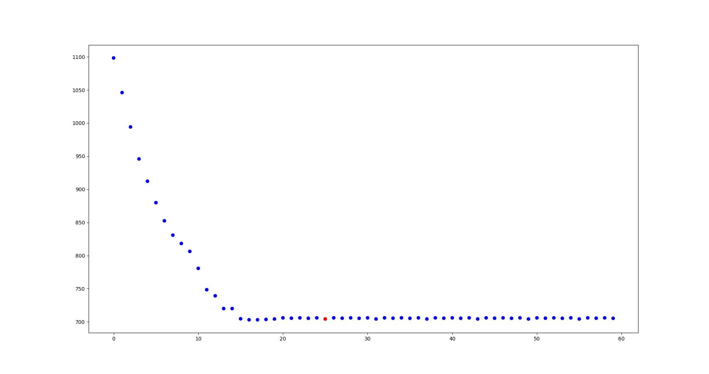
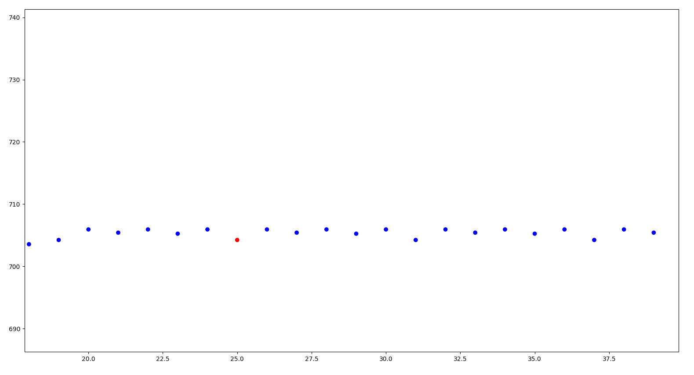
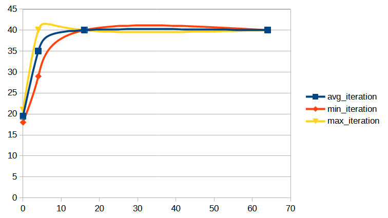
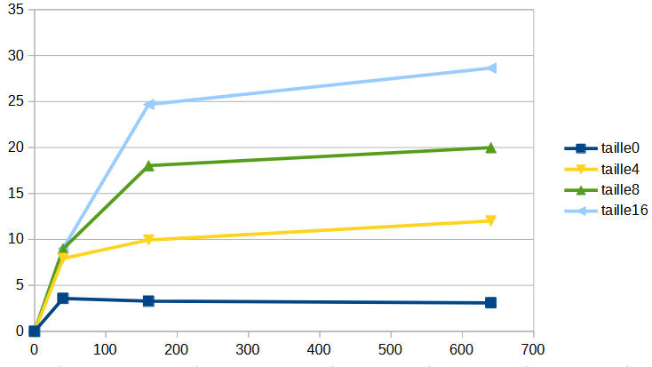
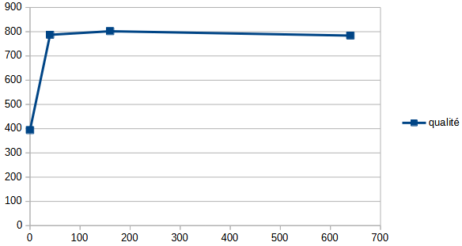

# Tabou
 
### Avant propos

Les métriques que nous avons calculées pour l'algorithme tabou sont les suivantes :
- size_tabu : taille de la liste tabou
- nb_iteration : le nombre d'itérations prévues
- fitness (avg, min, max)
- iteration (avg, min, max) : le nombre d'itérations réalisées. Nous reviendrons sur cette colonne plus tard
- duration (avg, min, max) : durée totale d'exécution
- avg_truck_removed : nombre moyen de camions enlevés par rapport à la solution initiale
- truck (avg, min, max) : nombre de camions de la solution finale
- avg_relocate (%) : pourcentage d'utilisation de l'opérateur de voisinage relocate
- avg_2_opt (%) : pourcentage d'utilisation de l'opérateur de voisinage 2-opt

L'analyse de cette algorithme sera réalisée principalement sur le fichier *moyenne_30.csv*. Ce fichier contient la moyenne de chaqu'une des métriques pour chacun des fichiers d'entrée. Nous avons choisi d'analyser ce fichier plutot que celui des 100 clients pour plusieurs raisons. D'abord, la quantité de données est bien supérieure. En effet, utiliser seulement les 30 premiers clients nous a permi de faire tourner 4 simulations pour chaque couple d'hyperparamètres. Ce point là est très important, car le résultat, particulièrement quand il y a peu d'itérations ou bien beaucoup de camions, est très influencé par la solution aléatoire de départ. Ainsi, il est nécessaire de faire plusieurs simulations afin de lisser l'effet de l'aléatoire (bien que 4 soit assez peu, il est toujours préférable à 1, qui est le nombre de simulation faite pour les fichiers complets donc 100 clients). Ensuite, les hyperparamètres choisis sont plus adaptés. En effet, les choix des hyperparamètres que nous allions utiliser ont été réalisés suite à une réflexion sur les premiers résultats. Or, ces premiers résultats ont été générés à partir des données des 30 premiers clients.  
Les hyperparamètres que nous avons testés sont le produit cartésien de ces deux listes :
- taille de la liste tabu : [0, 4, 16, 64]
- nombre d'itérations : [0, 40, 160, 640]
Nous expliquerons dans la suite du rapport le choix de certaines de ces valeurs.
Nous utiliserons parfois la notation (t, n), où t représente le paramètre taille de la liste et n le paramètre nombre d'itérations.
Lorsque nous parlerons de correlation, le fichier de référence sera `correl.csv`.

### Choix des opérateurs 

Pour réaliser cet algorithme, nous avons décidé d'utiliser les opérateurs 2-opt et relocate. Le choix des opérateurs doit être bien réalisé pour que l'algorithme fonctionne correctement.

#### Superposition

D'abord, il ne faut pas que deux opérateurs se superposent. En effet, si deux opérateurs peuvent donner une même solution à partir d'une solution initiale, alors la liste tabou ne pourra pas repérer que cette solution a déjà été explorée. Ainsi, si les opérateurs sont mal choisis, l'algorithme se retrouvera dans des boucles beaucoup plus rapidement.

#### Choix final

Au final, nous avons choisi d'utiliser le relocate et le 2-opt.  

##### Relocate

Notre choix c'est porté sur le relocate car c'est celui qui s'est révélé le plus efficace dans le recuit. De plus, c'est un opérateur qui permet de supprimer des routes, ce qui est important pour atteindre les solutions optimales.  

##### 2-opt

Nous avons choisi le 2-opt pour une autre raison : sa cohérence avec les fenêtres de temps. En effet, bon nombre d'opérateurs ne sont pas pertinents dans ce cas, car ils donneront énormément de résultats invalides. Par exemple, inverser tout l'ordre de la route sera dans la quasi totalité des cas impossible en respectant les fenêtres de temps. Le 2-opt, quant à lui, est très cohérent car il échange deux clients proches, ce qui a de grandes chances de fonctionner. De plus, il ne génère pas énormement de voisins, ce qui permet de réduire les temps de calcul.

#### Un autre bon candidat : le 3-opt

Nous avons également développé l'opérateur 3-opt, qui fait la même chose que le 2-opt en rajoutant un client entre les deux qui sont inversés. Cet opérateur était un bon candidat pour les même raisons que le 2 opt, mais s'avère moins efficace car il génère plus de solutions incompatibles avec les fenêtres de temps. Nous n'avons donc pas décidé de l'utiliser.

### Choix des hyper-parametres

#### Hyper paramètres particuliers

Nous avons séléctionné deux valeurs d'hyperparamètres pour des raisons particulières

##### 0 itération

D'abord, nous avons choisi d'utiliser le paramètre 0 itération. Ce choix est motivé par deux raisons :
- d'abord, il nous permettra de voir la fitness donnée par la solution aléatoire. Cela nous donnera un ordre d'idée du fichier sur lequel nous travaillons,
- ensuite, il permet de poser une base pour la matrice de corrélation. En effet, il permet de rajouter une valeur d'analyse permettant d'établir des corrélations sans devoir faire de calcul particulier. Ce choix est ainsi très interessant dans notre contexte où les données sont précieuses.

##### 0 place dans la liste tabou

Nous avons également choisi d'inclure le paramètre de 0 pour la taille de la liste tabou. Ce paramètre peut sembler déconcertant, car il enlève tout le principe de cet algorithme, mais c'est justement ce que nous voulions faire. En effet, si nous plaçons la taille de la liste à 0, alors nous effectuons l'algorithme hill climbing. Grâce à cette valeur, nous pourrons ainsi comparer l'algorithme hill climbing et le tabou.  
De même que pour la partie précedente, il permet également de poser une base pour les corrélations.

#### Choix de la métrique de comparaison

Comme vu précedemment, nous avons deux hyper-paramètres à séléctionner : la taille de la liste et le nombre d'itérations visé. Pour trouver les hyper-paramètres les plus adapatés, il faut ainsi trouver le couple qui donne les meilleurs résultats en terme de fitness. Cependant, nous pouvons voir dans le fichier *moyenne_30.csv* que, pour 30 éléments, plusieurs couples donnent des fitness moyennes très proches. Parmi ces couples certains ont une durée de calcul beaucoup plus longue. Ainsi, pour évaluer la qualité d'une solution, nous allons également mettre en jeu cette métrique de temps en faisant un ratio : 

$$
q=\frac{1}{f \times 2 + d} \times 1 000 000
$$
avec :
- $q$ la qualité de la solution,
- $f$ la fitness moyenne (à laquelle nous donnons deux fois plus de poids),
- $d$ la durée moyenne,
- la multiplication par 1 000 000 nous permettant de revenir dans des unités plus simples à analyser

#### Analyse des résultats du ratio

Avec ce calcul, nous obtenons ces trois meilleures couples :
- (4, 160) : 830.0
- (64, 40) : 827.7
- (16, 40) : 819.3
(les qualités des autres couples sont également disponibles dans l'annexe *quality.csv*)
Nous pouvons donc voir que la qualité du couple (4, 160) est la meilleure. Il est toutefois possible de change la multiplication de la fitness pour modifier l'importance qu'on lui porte.

#### Analyse pour les fichiers de 100 éléments

Nous avons effectué la même procédure pour les fichiers de 100 éléments, c'est qui nous donne ces trois meilleures couples :
- (16, 40) : 202.0
- (0, 40) : 201.0
- (4, 40) : 197.9

(les qualités des autres couples sont également disponibles dans l'annexe *quality_100.csv*)

Nous pouvons ici voir un fort impact du temps d'exécution. En effet, le temps d'exécution pour les fichiers de 100 éléments est très long, et impacte négativement la qualité du couple. 

En changeant le poids de la fitness à 10 au lieu de 2, nous pouvons ainsi voir les solutions avec plus d'itérations remonter dans le classement des scores (voir fichier *quality_100_x10.csv*).

### Détection de schéma

Une fois le développement de la liste tabu achevé, nous avons remarqué que dans la quasi totalité de nos premiers tests, nous pouvions visuellement voir une répétition de fitness. Cette répetition arrivait assez rapidement et nous avons donc penser qu'il serait utile de réaliser une détection de schéma afin d'éviter un grand nombre d'itérations inutiles.

Sur ce graphique, nous voyons où le schéma a été repéré en rouge. Pour voir plus clairement le schéma, voici une version zoomée sur la portion qui nous intéresse :

#### Développement

Pour réaliser cette détection, nous avons d'abord décider du système suivant :
une liste contient des dictionnaires, qui eux-mêmes stockent en clé la fitness et en valeur la liste tabou convertie en chaîne de charactères. L'idée derrière ce système était que si nous revenions à la même fitness avec la même liste tabou, alors nous sommes dans le même état que le début du cycle, et donc que nous allons tourner en boucle. Toute cette idée repose sur le fait que la fitness est unique pour chaque solution. Or, nous nous sommes rendu compte que ce n'était pas le cas et que deux solutions pouvaient avoir la même fitness. Ainsi, nous avons donc développer une fonctione de hashage de la solution qui nous permet d'avoir une clé réellement unique et de rendre cette détection de schéma fonctionnelle.

#### Analyse des résultats liés

Cette fonctionnalité nous a ammené à la métrique suivante : le nombre d'itérations réelles (en opposition avec le nombre d'itérations prévues au départ). Dans la suite du rapport, nous noterons les itérations réelles avec la notation IR et le nombre d'itérations prévues avec la notation IP

Nous pouvons remarqué un fait intéressant sur cette donnée. Dans le fichier des moyennes, nous remarquons d'abord que pour le hill climbing (càd taille tabu = 0), le nombre d'IR est globalement toujours le même, et toujours inférieur au nombre d'IP (environ 23 IR). Cela est assez simplement interpretable : le hill climbing converge aux alentours de ce nombre d'itérations. Ainsi, nous pouvons déduire que le bon hyperparamètre pour le hill climbing est de 23 itérations.

Pour revenir au tabou, nous pouvons voir sur ce graphique que l'IR évolue en fonction de la taille de la liste. 

Nous pouvons interpreter cela ainsi : plus la liste est grande, moins vite nous tomberons sur un cycle. Ainsi, la taille de la liste à une influence sur le niveau d'exploration. Nous reviendrons sur cette notion dans la partie "Lien entre les choix d'opérateurs et les autres variables"

### Analyse des utilisation des opérateurs

Comme dit précedement, nous avons décidé d'utiliser les opérateurs relocate et 2-opt. Ainsi, une métrique intéressante est la proportion de choix de chacun de ces opérateurs. 
En regardant la matrice de corrélation, nous pouvons observer un fort lien entre la proportion de 2-opt et le nombre d'IR et d'IP (0.48 et 0.86)
Nous pouvons ainsi observer une évolution de la proportion de 2-opt en fonction du nombre d'IP et de la taille de la liste sur ce graphique :
évolution de la proportion de 2-opt en fonction de la taille de la liste (abscisse : nb d'itération, ordonnée : proportion, les courbes représentent les différentes tialle de liste)

Notre interpretation de cette relation entre augmentation de la taille de la liste et augmentation du pourcentage de 2-opt est que, lorsqu'on effectue beaucoup d'itérations, les bonnes solutions du relocate sont dans la liste, donc impossible de les séléctionner. Cela se confirme si nous regardons ce graphique. En effet, nous voyons que pour un même nombre d'itérations, la proportion de 2-opt est plus grande. Ainsi, nous pouvons penser que toutes les bonnes solutions de relocate ont été séléctionnées et mise dans la liste, laissant plus de place au deuxième opérateur.

#### Lien entre les choix d'opérateurs et les autres variables

##### Lien avec le nombre de camions

Dans la matrice de correlation, nous pouvons également voir que le choix de l'opérateur relocate est très fortement corrélé avec le nombre de camions enlevés (0.96). 
Cette correlation est logique, le relocate étant le seul opérateur pouvant enlevé un camion.  

##### Lien avec l'exploration

Une autre relation très marquée est celle entre le choix de l'opérateur relocate et la fitness. En effet, nous pouvont voir une relation corellée dans le négatif (-0.97). Ainsi, quand la proportion de relocate augmente, la fitness diminue. Cette corrélation est liée à celle interprétée dans la partie précendente. En effet, la proportion de relocate diminue lorsque celle de 2-opt augmente. Or, la proportion de 2-opt augmente lorsque l'algorithme a le temps et la place de mettre les très bons voisins dans la liste. Ainsi, la proportion de 2-opt reflète le niveau d'exploration qui a été réalisé. Logiquement, plus l'exploration augmente, plus il y a d'opportunité de trouver une solution possédant une bonne fitness. Cette hypothèse se confirme grâce à une autre corrélation : celle entre la durée moyenne et la proportion de 2-opt (0.86). En effet, une durée plus haute nous indique une exploration plus profonde.

### Analyse de la fitness

Nous allons maintenant voir quelles variables sont en lien avec la fitness de la solution finale.

#### Lien avec le nombre de camions

Nous pouvons d'abord constater un lien très fort entre le nombre de camions de la solution finale et sa fitness (-0.99). En parallèle, nous pouvons également voir la même relation entre le nombre de camions enlevés et la fitness (0.99). Cette relation s'explique intuitivement par le fait que les meilleures solutions ont, en général, moins de camions que les solutions générées aléatoirement.

#### Lien avec le nombre d'IR

Nous pouvons ensuite voir un lien fort (mais toutefois moins que celui précedemment évoqué) entre la fitness et le nombre d'IR (-0.48). Ce lien nous montre que plus on réalise d'itérations, moins la fitness sera haute (et donc meilleure sera la solution). Encore une fois, ce résultat est assez intuitif et ne nécessite pas une plus grande analyse.

### Comparaison tabou / hill climbing

Comme dit précedement, le choix des hyper-paramètres (0, x) nous permettent d'avoir les résultats du hill climbing. Ainsi, nous allons comparer ces résultats avec ceux du tabou afin de voir si la mise en place d'une liste tabou à un impact notable.

#### Qualité

Nous allons réutiliser notre ratio précedent afin de comparer les qualités entre les deux algorithme. Nous pouvons voir dans l'annexe *quality.csv* que, pour les couples (0, x) la qualité est globalement constante pour 40, 160 et 640 IP. Cette valeur semble cohérente avec notre analyse précédente : l'algorithme converge rapidement et le nombre d'IP n'a donc que peu d'influence une fois cette converge passée. 

Nous pouvons voir ce phénomène sur ce graphique (qui représente en ordronnée la qualité et en abscisse le nombre d'itérations pour le hill climbing)

La meilleure qualité est de 802. 

Pour le tabu, nous voyons des résultats plus disparatre de qualité. Nous voyons bien l'importance de la notion de temps dans la formule, car les scores de qualité ne sont pas beaucoup plus élevés que pour le hill climbing. Le score maximum, comme vu précedemment, est de 830. Toutefois, si on ne regarde que la fitness, les scores sont plus notablement avantageux en faveur du tabou, avec une meilleure fitness à 578 contre 617 pour le hill climbing.  

Ainsi, la méthode tabu est plus avantagueuse que le hill climbing sur le plan de la fitness. Toutefois, le temps passé à faire tourner l'algo peut faire pencher la balance du côté du hill climbing si les ressources et le temps disponible ne sont pas très élevés.

### Limites du tabou

La principale limite de l'algorithme tabou est la quantité de voisins à générer. En effet, à chaque itération, tous les voisins possibles avec les opérateurs choisis sont générés.  

Cette croissance peut nous pousser à limiter les opérateurs afin de limiter le nombre de voisins. 
De plus, une autre limite est le choix des opérateurs. En effet, comme vu précédemment, il n'est pas possible de choisir deux opérateurs qui ont une intersection non-nulle.  

Une autre limite du tabou est la vision court terme. En effet, la décision de la solution choisie se base exclusivement sur sa fitness. Or, il serait pertinent que le choix se base plutôt sur la potentielle fitness que cette solution apportera dans le futur. Ce manque de vision long terme se reflète à travers le nombre de camions. En effet, nous avons remarqué que l'algorithme trouvait parfois des solutions non optimales et si retrouvait bloqué. Dans les fichiers de 30 éléments, nous avons par exemple remarqué qu'il s'arretait parfois alors qu'il restait un camion en trop par rapport à la solution optimale. La solution avec le camion en trop possédait une très bonne fitness, mais il était parfois impossible de sortir de ce minimum local et d'explorer jusqu'à enlever la route en trop. Nous pourrions penser que ce problème est mitigé par la liste, qui permet une certaine exploration. Cela est en partie vrai, mais pas totalement. En effet, il est possible que l'algorithme suive une direction d'exploration complètement opposée à la solution optimale totale, et donc qu'il ne découvre jamais l'opportunité d'enlever le camion (bien qu'une liste plus grande permet une plus grande exploration).

### Solutions éventuelles
**TODO**

### Difficultés rencontrés

Durant le développement de cet algorithme, nous nous sommes heurté à de nombreuses difficultés

#### Le stockage dans la liste

Notre principale difficulté a été le stockage dans la liste tabou. En effet, dans notre première version, nous stockions l'action que nous venions d'effectuer. Cette interprétation de l'algorithme n'était pas la bonne. En effet, il faut stocker dans la liste l'action qui nous permettrait de revenir à l'état dans lequel nous étions précedemment. Cela c'est révélé assez simple pour le 2-opt, car les actions sont reversibles. Mais la difficulté a résidé dans le relocate. En effet, trouver l'action inverse d'un déplacement d'un client dans une autre route est une tâche plus compliquée. Ne voyant pas comment la réaliser, nous avons commencé le développement de l'algorithme hill climbing et avons décidé de nous contenter de cette méta heuristique. Mais nous avons fini par trouver la solution pour pouvoir implémenter le tabou correctement et avons pu terminer les développements de l'algorithme tabou. 

#### Temps de génération

Une autre difficulté est apparue lorsqu'il a fallu générer les données. En effet, l'algorithme étant très lent pour les gros jeux de données, et en étant limité par le language python, nous n'avons pas pu effectuer toutes les exécutions que nous aurions voulues pour avoir une analyse plus poussée (nous aurions pu, si nous avions fait plus d'exécutions pour le même couple, analyser les quartiles et la médiane par exemple, au lieu de ce limiter à la moyenne).
