# Rapport VRPTW Optimisation Discrète

GURUPHAT Nicolas & MOUTOTE Grégory

## Introduction

Le problème de routage de véhicules avec fenêtres de temps (VRPTW) est un problème bien connu en optimisation combinatoire, il consiste à trouver le ou les meilleurs chemins pour livrer des clients en établissant un ensemble de routes composées de camions. Même s'il existe bien des variantes de ce problème, il est dans tous les cas difficile de lui trouver une solution optimale dans un temps raisonnable. C'est dans ce cadre que sont utilisées des métaheuristiques pour trouver une bonne solution le plus rapidement possible, sans forcément trouver un résultat optimal. Dans la suite, nous aborderons deux métaheuristiques, le Tabou et le Recuit Simulé.

## Technologies et décisions techniques

Pour implémenter les deux métaheuristiques, nous avons décidé d'utiliser le langage Python avec les bibliothèques Numpy, NetworkX et Matplotlib principalement. Ce langage présente l'avantage d'être fourni pour tout ce qui concerne l'analyse et le traitement de données en plus d'être facile d'accès, cela en fait un excellent candidat pour générer, traiter et analyser des données concernant les résultats fournis par les métaheuristiques.

## Recuit simulé

### Avant propos

Les données qui ont servi l'analyse du recuit simulé ont été récoltées sur des ordinateurs différents, les temps d'exécution récoltés ne partagent donc pas tous le même référentiel matériel.  
L'ensemble des simulations a été fait à partir du produit cartésien de ces différents ensembles de valeurs pour les différents hyper-paramètres :  
- $\mu : \{0.5,0.6,0.7,0.75,0.8,0.85,0.9,0.91,0.92,0.93,0.94,0.95,0.96,0.97,0.98\}$
- opérateurs de voisinage utilisés : {Relocate, Relocate + Exchange, Relocate + Cross-Exchange, Relocate + Exchange + Cross-Exchange, Relocate + Reverse, Relocate + Exchange + Cross-Exchange + Reverse}
- $$n_2 : \begin{cases} 10000,& si \space \mu \in \{0.5,0.6,0.7,0.75,0.8,0.85,0.9,0.91,0.92,0.93\} \\ 1000,& si \space \mu \in \{0.94,0.95,0.96,0.97,0.98\} \end{cases}$$
- $t_0 : \{3,4,5,6,7,8,9,10,15,20,25,30,40,50,60,70,80,90,100,150,200,300,400,500,1000\}$  

Pour des raisons logistiques (principalement de temps), seule une itération a été effectuée pour chaque combinaison d'hyper-paramètres, hormi pour $\mu = 0.5$ mais cela sera ignoré. $n_2$ a également été réduit pour des valeurs de $\mu$ élevées car le temps d'exécution devenait trop important ($n_1 = 149$ pour $\mu = 0.98$)  
Les simulations ont été effectuées à partir d'une solution aléatoire non-optimisée. La solution aléatoire donne la priorité aux clients qui attendent d'être livrés et ne se rend chez un client qui n'est pas encore prêt pour attendre uniquement s'il n'y a plus de clients en attente.

### Mise en place

Dans un premier temps le recuit simulé a été appliqué aux trente premiers clients du fichier `data_101.vrp` sans tenir compte des fenêtres de temps. La fonction de fitness a été choisie comme la somme des distances parcourues par les camions. Dans une perspective de valoriser un plus faible nombre de camion, une fonction de fitness integrant une pénalité pour chaque camion et une pénalité pour les camions avec trop de paquets restants a été expérimentée sans que cela n'apporte de bénéfice aux résultats car la distance à elle-seule pénalise les camions superflus à travers l'allé retour à l'entrepot qui en découle.  
Parmi les opérateurs de voisinage implémentables, seuls Relocate (inter et intra), Exchange (inter et intra), Cross-Exchange (intra) et Reverse (inter) ont été choisis. Parmi ces derniers, l'usage d'un opérateur permettant de vider une route est important car la solution aléatoire initiale peut comporter des véhicules dispensables qui devront être supprimés pour se rapprocher d'une solution la plus optimale possible.  

### Influence et synergie des hyper-paramètres

L'objectif ultime serait de trouver une combinaison d'hyper-paramètres qui donne une bonne solution (de préférence une optimale) dans un temps le plus court possible. Pour cela, il serait intéressant de chercher combien de tours de recuit sont nécessaires pour atteindre notre objectif et surtout, comment déterminer cette valeur en fonction de la taille du jeu de données. Nous nous intéresserons donc à deux axes :
- Un $\mu$ grand (proche de 1) avec un $n_2$ petit
- Un $\mu$ petit (proche de 0.5 car 0 est trop faible) avec un $n_2$ grand

La principale différence entre ces deux cas est qu'avec un $\mu$ grand, les $n_1$ itérations auront des températures similaires d'un tour à l'autre alors que pour un $\mu$ faible, la température va drastiquement changer mais sur un moins grand nombre d'itérations (car $n_1$ sera plus petit car dépendant de $\mu$).  

Nous avons donc cherché quels hyper-paramètres influaient le plus sur la qualité de la solution. Nous avons pour cela utilisé une matrice de corrélation (cours d'Analyse des Données Multidimensionnelles qui nous est dispensé durant le S8). Cela nous a permis d'obtenir ceci :

$ \begin{pmatrix}
1.00 & 0.00 & -0.00 & 0.00 & -0.02 & -0.25 & -0.03 & 0.01 & 0.10 \\
0.00 & 1.00 & 0.00 & 1.00 & -0.00 & 0.35 & 0.32 & 0.12 & -0.04 \\
-0.00 & 0.00 & 1.00 & 0.00 & 0.01 & -0.12 & 0.08 & -0.38 & -0.31 \\
0.00 & 1.00 & 0.00 & 1.00 & -0.00 & 0.35 & 0.32 & 0.12 & -0.04 \\
-0.02 & -0.00 & 0.01 & -0.00 & 1.00 & -0.02 & 0.01 & 0.00 & -0.03 \\
-0.25 & 0.35 & -0.12 & 0.35 & -0.02 & 1.00 & -0.19 & 0.37 & 0.12 \\
-0.03 & 0.32 & 0.08 & 0.32 & 0.01 & -0.19 & 1.00 & -0.17 & 0.05 \\
0.01 & 0.12 & -0.38 & 0.12 & 0.00 & 0.37 & -0.17 & 1.00 & -0.03 \\
0.10 & -0.04 & -0.31 & -0.04 & -0.03 & 0.12 & 0.05 & -0.03 & 1.00 
\end{pmatrix}  $

avec, dans l'ordre : $mu$, la température finale, les opérateurs utilisés, la température initiale, la fitness initiale, la fitness finale, le nombre d'itérations avant d'atteindre le meilleur minimum calculé, le nombre de camions en sortie, le temps d'exécution.

On peut en extraire quelques valeurs :
- 0.35 : la corrélation entre la température finale et la fitness finale
- 0.32 : la température finale et le nombre d'itérations avant le meilleur minimum
- -0.38 : les opérateurs utilisés et le nombre de camions
- -0.31 : les opérateurs utilisés et le temps d'exécution
- 0.35 : la température intiale et la fitness finale
- 0.32 : la température initiale et le nombre d'itérations avant le meilleur minimum
- 0.37 : la fitness finale et le nombre de camions

Certains critères ne sont pas à leur avantage à cause de la façon dont les données ont été générées. Par exemple la température initiale qui est aléatoire ne peut pas être correctement corrélée à un autre critère avec des hyper-paramètres changeant à chaque itération.  
Le plus intéressant est d'observer la température finale (et intiale car $t_{n1} = \mu^{n_1}\times t_0$), on en déduit donc qu'en déterminant la plage de températures finales qui donnent une solution optimale, on peut déterminer le $\mu$ adéquat.  
La corrélation entre les opérateurs utilisés et le nombre de camions a un sens puisque la capacité à vider une route dépend des opérateurs et influe sur le nombre de camions.  
Les opérateurs utilisés et le temps d'exécution est aussi logique car certains opérateurs sont plus gourmands en temps processeur (cross-exchange par exemple). L'objectif sera donc de trouver le groupe d'opérateurs demandant le moins de temps mais permettant de réduire le nombre de camions.  
Nous avons également expliqué que la fitness était intrinsèquement reliée aux nombres de camions, il est donc logique de voir ces derniers corrélés.  
Toutes les corrélations abordées ci-dessus étaient cohérentes et/ou attendues. Cependant, le fait que la température finale/initiale soit corrélée au nombre d'itérations avant le meilleur minimum, et cela avec le même signe (positif) que la température et la fitness, est très intéressant car on peut donc espérer avoir une bonne solution avec un nombre d'itérations limitées !

Nous allons donc nous intéresser à quelques unes de ces corrélations.

#### Température finale et fitness finale

À partir des données récoltées, en récupérant toutes les températures finales qui ont données une solution optimale pour le jeu de données d'entrée. On en déduit qu'en moyenne $t_{n1} = 0.8624991157717019$ donne de bons résultats. Il est intéressant de noter que la température finale maximale donnant une solution optimale croît avec $\mu$, par exemple, elle est de :

| $\mu$ | $max(t_{n1})$ tel que $x$ est une solution optimale avec $x$ résultat du recuit simulé |
|---|---|
| 0.5 | 0.14536501951208458 |
| 0.6 | 0.1938200260161128 |
| 0.7 | 4.845500650402822 |
| 0.75 | 14.536501951208459 |
| 0.8 | 48.45500650402821 |
| 0.85 | 48.4550065040282 |
| 0.9 | 48.455006504028226 |
| 0.91 | 48.45500650402821 |
| 0.92 | 48.45500650402819 |
| 0.93 | 48.455006504028205 |
| 0.94 | 24.22750325201411 |
| 0.95 | 14.536501951208459 |
| 0.96 | 7.268250975604232 |
| 0.97 | 24.227503252014102 |
| 0.98 | 2.9073003902416916 |

Il subsiste tout de même un biais qui est la qualité de la solution aléatoire qui peut influer sur la qualité de la solution en sortie, de ce fait, le tableau ci-dessus n'est qu'une possibilité et l'aléatoire du recuit simulé (choix du voisin) combiné à la qualité aléatoire de la solution initiale aurait très bien pu produire $t_{n1} = 100$ pour $\mu = 0.9$ par exemple.

Nous noterons également que la corrélation entre la température finale et la fitness finale est très importante pour les $\mu$ petits jusqu'au passage de 0.75 à 0.85 où la corrélation passe de 0.63 à 0.15. La corrélation pour $\mu = 0.5$  et $\mu = 0.6$ sont respectivement de 0.86 et 0.88, élément important car si l'objectif est d'arriver à une température finale inférieure à 1 avec une température intiale calculée, plus le jeu de données en entrée sera grand, plus la température intiale risque d'être élevée et donc plus $\mu$ devra s'éloigner de 1 ($t_{n1}=\mu^{n1}\times t_0$). En combinant ces deux aspects, on peut aisément supposer que travailler avec des $\mu$ petits présente un intérêt.

Nous allons donc chercher à calculer $\mu$ en fonction de $t_{n1}$ et $t_0$ :
$$
t_{n1} = \mu^{n1} \times t_0
\newline \Leftrightarrow

t_{n1} = \mu^{\frac{\ln(\frac{\ln(0.8)}{\ln(0.01)})}{\ln(\mu)}} \times t_0
\newline \Leftrightarrow

\ln(t_{n1}) = \ln(\mu^{\frac{\ln(\frac{\ln(0.8)}{\ln(0.01)})}{\ln(\mu)}} \times t_0)
\newline \Leftrightarrow

\ln(t_{n1}) = \ln(\mu^{\frac{\ln(\frac{\ln(0.8)}{\ln(0.01)})}{\ln(\mu)}}) + \ln(t_0)
\newline \Leftrightarrow

\ln(t_{n1}) = \frac{\ln(\frac{\ln(0.8)}{\ln(0.01)})}{\ln(\mu)} \times \ln(\mu) + \ln(t_0)
\newline \Leftrightarrow

\ln(t_{n1}) = \ln(\frac{\ln(0.8)}{\ln(0.01)}) + \ln(t_0)
$$
Nous arrivons donc à une impasse dans ce cas, cela est logique car il existe une infinité de solutions pour $t_{n1} = \mu^{\frac{\ln(\frac{\ln(0.8)}{\ln(0.01)})}{\ln(\mu)}} \times t_0$  
Nous allons donc calculer $\mu$ à partir de $t_{n1}$, $t_0$ et $n_1$ :

$$
t_{n_1} = \mu^{n_1} \times t_0
\newline \Leftrightarrow

\ln(t_{n_1}) = \ln(\mu^{n_1} \times t_0)
\newline \Leftrightarrow

\ln(t_{n_1}) = \ln(\mu^{n_1}) + \ln(t_0)
\newline \Leftrightarrow

\ln(t_{n_1}) = n_1 \times \ln(\mu) + \ln(t_0)
\newline \Leftrightarrow

\ln(t_{n_1}) - \ln(t_0) = n_1 \times \ln(\mu) 
\newline \Leftrightarrow

\frac{\ln(t_{n_1}) - \ln(t_0)}{n_1} = \ln(\mu) 
\newline \Leftrightarrow

e^{\frac{\ln(t_{n_1}) - \ln(t_0)}{n_1}} = e^{\ln(\mu)} 
\newline \Leftrightarrow

\mu = e^{\frac{\ln(t_{n_1}) - \ln(t_0)}{n_1}}
$$

Nous avons $t_0 = \frac{-\Delta f}{\ln(0.8)}$ et $t_{n_1} = 0.86$. Reste à déterminer $t_{n_1}$.  
Pour cela, il faudrait trouver une valeur qui dépende de la taille de l'entrée. Plus la taille de l'entrée est grande, plus l'écart entre la fitness de la meilleure solution et celle de la pire est grand ou au moins constant (Raisonnement par l'absurde, si la différence entre la fitness de la meilleure solution et celle de la pire diminuait quand la taille de l'entrée augmente, alors la pire solution serait égale/semblable à la meilleure pour une taille d'entrée $x_{k}$ avec $k \longrightarrow \infty$ **et donc aussi pour $x_{k+1}$ !**. Or cela est vrai pour un et deux clients mais par pour trois alors c'est absurde). $\Delta f$ calculé à partir de solutions aléatoires pourrait donc être une bonne piste, il est, cependant, trop élevé pour être utilisé tel quel. Il existe plusieurs fonctions permettant de réduire cette valeur pour éviter un trop grand nombre d'itérations tout en évitant de trop rapidement converger vers l'infini : racine carrée et logarithme néperien. Nous continuerons donc avec $n_1 = \sqrt{|\Delta f|}$ ou $n_1 = \ln{|\Delta f|}$

Si on implémente cela, dans le cas des trente premiers clients du fichier 101, on constate facilement que $n_1$ est très voire trop petit si calculé avec $ln$ (environ 3-4) et la solution finale peine à avoir une fitness en dessous de 400 alors que l'optimale est d'environ 358 contrairement à $\sqrt{}$, pour laquelle les valeurs de $n_1$ sont plus correctes (6-8) et où l'optimal est parfois atteint (environ une fois sur dix dans le cas présent). On remarque que c'est discutablement efficace pour un petit jeu de données.  
Si on reprend les cent clients du fichier data101, $\Delta f$ est bien évidemment plus élevé et donc $n_1$ aussi. Nous reviendrons sur l'analyse des résultats avec un $\mu$ calculé par la suite.

#### Température finale et nombre d'itérations avant le meilleur minimum

#### Le choix des opérateurs

Intéressons-nous maintenant à la fitness finale en fonction des opérateurs pour pouvoir déterminer quel groupe d'opérateurs pourrait être le plus pertinent.

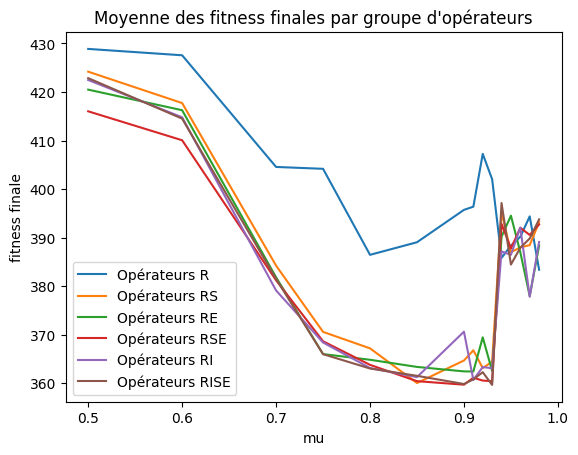

(R: Relocate, S: Switch, E: Cross-Exchange, I: Reverse)  

On peut voir que Relocate seul n'est pas très efficace pour trouver une bonne solution et que les autres groupes testés restent assez homogènes. Nous allons quand même nous intéresser à deux groupes, RS et RSE. Nous allons ignorer les groupes avec Reverse car il n'améliore pas directement la fitness et est trop difficile à appliquer avec des fenêtres de temps.
- RSE : Très clairement le meilleur avec un $\mu$ faible ( $<0.65$ ), ce qui devrait être notre cas post-analyse. Il se confond avec les autres courbes à mesure que $\mu$ augmente. Le cross-exchange reste cependant plus coûteux en temps et plus la taille des morceaux échangés est grand, moins il a de chance d'être compatible avec les fenêtres de temps.
- RS : Relocate et Switch représentent le compromis entre efficacité (temps d'exécution) et pertinence, même s'il est dans le pire groupe quant à la fitness obtenue, il reste proche du reste du classement. Une bonne alternative pour se permettre de faire quelques tours de boucles supplémentaires si on veut réutiliser le temps économiser par la vitesse d'exécution.

Dans le cadre de la mise en place des fenêtres de temps, nous nous concentrerons donc principalement sur le couple d'opérateurs Relocate Switch.

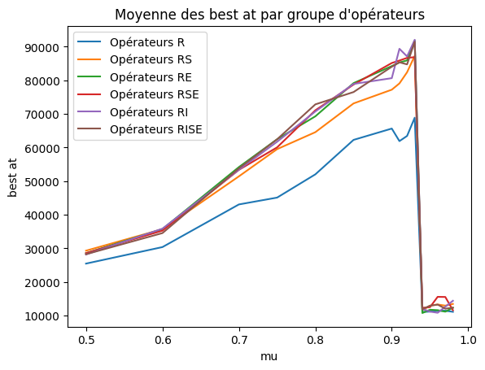

On peut voir que la vitesse de convergence est inversement porportionelle à la fitness finale. Malgré une fitness finale moins bonne, on pourrait donc envisager l'usage de Relocate comme seul opérateur si on veut une convergence rapide.

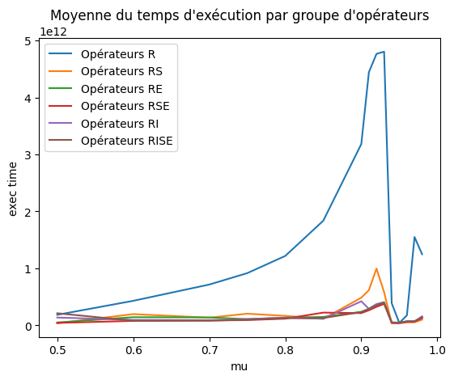

Sur ce graphique on peut voir que Relocate seul prend beaucoup de temps, donc malgré une convergence rapide, son exécution est plus longue. Cela motive donc notre choix de rester sur les groupes d'opérateurs Relocate Switch Cross-Exchange et Relocate Switch.

### Mu calculé avec fenêtres de temps, Relocate + Switch vs Relocate + Swich + Cross-Exchange

Nous allons poursuivre l'analyse avec les cent clients du fichiers 101 et les fenêtres de temps.  
La sélection aléatoire d'un voisin implique que l'on doit chercher un voisin valide (qui respecte les contraintes temporelles, de capacité). Ces voisins sont moins nombreux avec les fenêtres de temps et donc la recherche dure plus longtemps. Cela a donc un impacte important que n'a pas un Tabu qui cherche tous les voisins. Mais dans le cas du recuit, les fenêtres de temps signifient aussi un $\Delta f$ plus important donc un $n_1$ calculé plus élevé avec un nombre de solutions valides plus faibles, on devrait donc pouvoir visiter une plus grande proportion de solutions et donc avoir plus de chance de se rapprocher d'un résultat optimal.  

Prenons la moyenne de cinq résultats pour les groupes d'hyperparamètres suivants :

| Hyper paramètres | Moyennes des meilleures fitness observées |
|---|---|
| Relocate + Switch, SQRT | 1660 |
| Relocate + Switch, LN | 1733 |
| Relocate + Switch, 2*SQRT | 1658 |
| Relocate + Switch, 2*LN | 1665 |
| Relocate + Switch + Cross-Exchange, SQRT | 1720 |
| Relocate + Switch + Cross-Exchange, LN | 1858 |
| Relocate + Switch + Cross-Exchange, 2*SQRT | 1821 |
| Relocate + Switch + Cross-Exchange, 2*LN | 1834 |

On voit donc que le couple Relocate + Switch donne de meilleurs résultats, observation que l'on peut appuyer si on jette un oeil à ce tableau mais sur les trente premiers clients seulement avec des conditions similaires (nombre d'exécutions):

| Hyper paramètres | Moyennes des meilleures fitness observées |
|---|---|
| Relocate + Switch, SQRT | 682 |
| Relocate + Switch, LN | 682 |
| Relocate + Switch, 2*SQRT | 682 |
| Relocate + Switch, 2*LN | 682 |
| Relocate + Switch + Cross-Exchange, SQRT | 799 |
| Relocate + Switch + Cross-Exchange, LN | 767 |
| Relocate + Switch + Cross-Exchange, 2*SQRT | 779 |
| Relocate + Switch + Cross-Exchange, 2*LN | 770 |

On remarque que dans le cas présent, sur les vingt recuits effectués avec Relocate + Switch, la solution optimale à été obtenue 19 fois (95%) alors que Relocate + Switch + Cross-Exchange n'a pas atteint l'optimal une seule fois.

#### Convergence

Pour les trente premiers clients du fichier 101 avec les fenêtres de temps, voici un tableau de la moyenne du nombre d'itérations avec de trouver le plus petit minimum en fonction des hyper-paramètres effectués sur cinq exécutions du recuit :

| Fonction de calcul de $n_1$ \ Opérateurs utilisés | RS | RSE |
|---|---|---|
| SQRT | 61187 sur 88500 | 2399 sur  67000 |
| LN | 33653 sur 41990 | 7203 sur 40000 |
| 2*SQRT | 77919 sur 145000 | 12366 sur 138000 | 
| 2*LN | 61146 sur 83000 | 5113 sur 79000 |

Et pour les cent premiers clients du même fichier :

| Fonction de calcul de $n_1$ \ Opérateurs utilisés | RS | RSE |
|---|---|---|
| SQRT | 90673 sur 110000 | 87769 sur  123000 |
| LN | 42015 sur 50000 | 37759 sur 46000 |
| 2*SQRT | 121919 sur 230000 | 110112 sur 222000 | 
| 2*LN | 85110 sur 100000 | 79245 sur 100000 |

Si on s'intéresse au nombre d'itérations avec l'obtention de la meilleure solution pour l'exécution du recuit, on peut voir que cette valeur est plus ou moins inférieure au nombre total d'itérations (Proche de $best\_at \longrightarrow n_1 \times n_2$ pour $n_1$ calculé avec $\sqrt{}$ alors qu'il est proche de la moitié pour $2\sqrt{}$). Sachant qu'il était difficile d'attendre une bonne valeur pour les trente premiers clients, on peut en déduire que $n_1$ en fonction de la taille de l'entrée croît plus vite que le le nombre d'itérations nécessaires pour obtenir une bonne solution en fonction de cette même taille. On remarque aussi que le nombre d'itérations nécessaires est moins élevé avec Relocate + Switch + Cross-Exchange mais cela car les résultats sont moins bons (cf partie précédente).

Si l'on doit choisir une façon de calculer $n_1$, on va tout d'abord rejeter $\ln$ qui donne des résultats sensiblement moins bons car ne laissent pas la convergence se faire à cause de valeurs trop petites. Les trois autres façons donnent des résultats similaires, il faudrait donc d'autres essais avec des jeux de données plus conséquents pour voir si une différence apparait entre ces derniers mais nous choisirons $\sqrt{}$ pour la suite pour réaliser le reste de l'analyse avec trente ou cent clients.

Essayons maintenant de voir si la température finale $t_{n_1}$ peut avoir un impact intéressant sur la qualité des solutions. Nous avons précédemment déterminé que $t_{n_1} = 0.86$ pouvait être une bonne température finale et que cette même température devait être plutôt basse (voire corrélation ci-dessus). Mais tentons de la réduire, par exemple $t_{n_1} = 0.05$, pour voir si cela peut améliorer la solution :

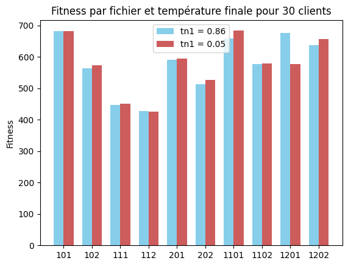

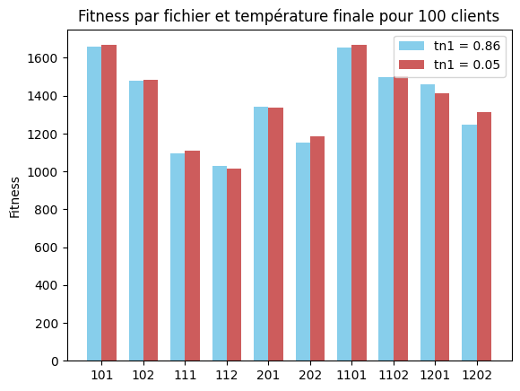

On observe une forte similitude entre les résultats, on en déduit que les deux températures finales ont un impact similaire sur la qualité de la solution et qu'il n'est pas nécessaire de diminuer $t_{n_1}$ en dessous de $0.86$.

#### Augmenter la granularité de la température

Dans cette partie nous allons essayer de déterminer s'il existe un bénéfice à rendre plus granulaire l'évolution de la température en diminuant $n_2$ et en augmentant $n_1$ ($\div 10$ et $\times 10$ respectivement). Pour ce faire, nous allons comparer une exécution avec $n_1 = \sqrt{|\Delta f|}$ et $n_2 = 10000$ (dénommée classique) avec $n_1 = 10\times \sqrt{|\Delta f|}$ et $n_2 = 1000$ (dénommée granulaire) pour l'ensemble des fichiers de données avec trente et cent clients. Les fitness représentées sont une moyenne sur cinq exécutions :

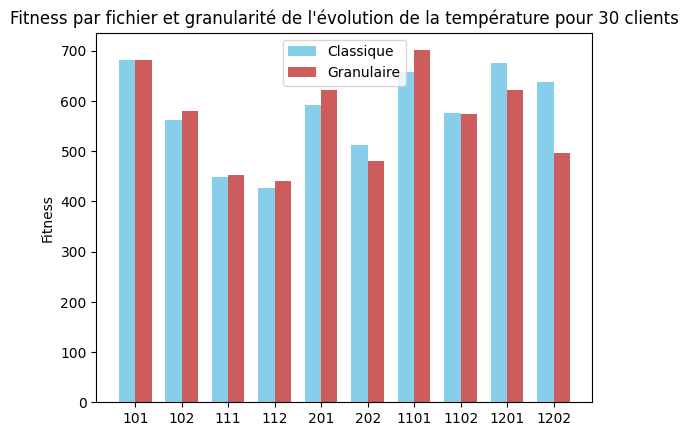

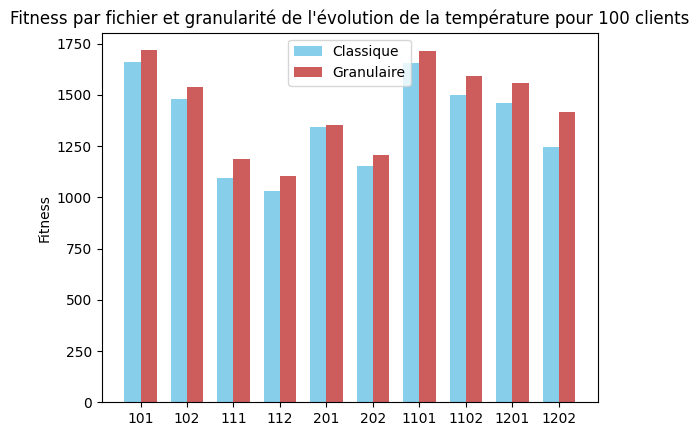

On peut remarquer que les fitness sont très proches (hormis dans un cas mais l'aspect aléatoire est important avec un nombre d'exéctions aussi "petit"). Dans le cas des cent clients, on observe même que l'exécution classique donne de sensiblement meilleurs résultats. Pour comprendre ce qui pourrait en être la cause, cherchons à analyser l'évolution de la température durant l'exécution :

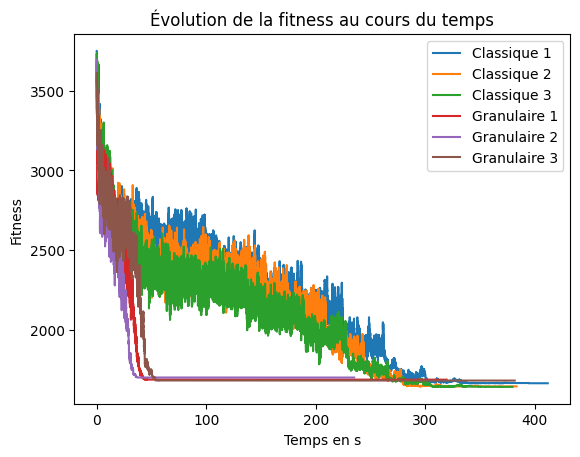

On peut observer que les recuits exécutés avec une évolution plus granulaire de la température converge radicalement plus vite (très rapidement, trois fois plus rapide). Mais les solutions sont légèrement moins bonnes et cela car la convergence est plus rapide donc moins exploratoire. On peut donc envisager d'utiliser l'une des façons de faire suivant le cas, si on veut un résultat rapide, une granularité forte est plus intéressante au détriment de quelques minutes sur la fitness du résultat.

#### Qualité de la solution

Pour essayer de juger la qualité des résultats du recuit, la fitness est intéressante mais manque d'un référentiel pour passer du quantifiable au qualifiable. Pour la suite, nous travaillerons avec l'ensemble des fichiers de données et avec trente et cent clients ainsi que les fenêtres de temps. Les résultats seront comparés aux résultats gloutons (avec une priorité aux clients directement livrables les plus proches).
Les résultats du recuit sont la moyenne de cinq exécutions :

| Fichier du jeu de données (nombre de clients) | Glouton | Recuit |
|---|---|---|
| 101 (30) | 1089.282448171974 | 682.0534548509409 |
| 102 (30) | 1057.6737806455794 | 562.489530446921 |
| 111 (30) | 922.9133908185511 | 447.8438852063749 |
| 112 (30) | 606.1457655565695 | 426.61303409117215 |
| 201 (30) | 851.094076314574 | 591.2809920884785 |
| 202 (30) | 746.8752190488493 | 512.0894746685451 |
| 1101 (30) | 1180.6508074676167 | 657.8911032719449 |
| 1102 (30) | 1059.5755092274464 | 576.4275152029046 |
| 1201 (30) | 1234.2533327152512 | 676.1370847001465 |
| 1202 (30) | 1030.373582292059 | 637.2148409803067 |
| 101 (100) | 3107.7777100922544 | 1660.761803803932 |
| 102 (100) | 2956.4952202799095 | 1480.0127288033807 |
| 111 (100) | 2081.840103804694 | 1095.1646970808329 |
| 112 (100) | 2076.9618938202198 | 1029.4272261284739 |
| 201 (100) | 2511.9294477406997 | 1341.800344504427 |
| 202 (100) | 2339.502433057424 | 1151.0044957741725 |
| 1101 (100) | 3509.0538453669546 | 1652.9365326292343 |
| 1102 (100) | 3259.497225301454 | 1498.1078117170505 |
| 1201 (100) | 3149.177595442274 | 1457.987890701932 |
| 1202 (100) | 3327.9963142188844 | 1244.7769345543302 |

On peut observer, pour le recuit, une division presque par deux de la fitness du glouton pour une grande partie des cas. Cela montre son utilité surtout avec une pire exécution n'ayant durée qu'environ treize minutes et une moyenne globale de 370 secondes (6min10s) pour les cent clients et de 78 secondes (1min18s) pour les trente premiers clients. 

### Difficultés et axes d'amélioration

Le plus gros frein durant nos expérimentations et notre analyse fut le temps d'exécution et donc le langage utilisé. Même si ce choix était déjà controversé avant même le développement, nous avons quand même décidé de conserver le langage Python pour être certain de mener à bien le développement même si cela impactait négativement le temps nécessaire pour la génération de données.  
Ce manque de temps qui en a résulté a donné lieu à un second obstacle, la quantité de données générées n'était pas assez importante pour pouvoir correctement illustrer des hypothèses ou interpréter les résultats avec le bon recul (par exemple une exécution pour un groupe d'hyper-paramètres n'est pas assez).  
Nous avons également rencontré un problème avec $\mu = 0.99$ qui créait parfois une erreur (qui n'était pas forcément la même à chaque fois) lors de l'exécution du recuit, le problème racine n'étant pas flagrant, nous n'avons pas prioriser ce fait et avons préféré privilégier la suite de l'analyse.  
Une optimisation/amélioration du code serait également pertinente pour éviter les nombreux cas où le recuit fonctionnait sur un temps anormal (plus d'un quart d'heure pour la sélection d'un voisin), pour régler cela, nous avons mis en place une durée maximale (trois minutes) pour la sélection du voisin aléatoire et du tour de boucle $n_1$ (donc les $n_2$ itérations).

### Conclusion

Nous avons donc pu voir à quel point les hyper-paramètres utilisés sont importants pour avoir un recuit simulé efficace et pertinent. Nous avons, par la même occasion, exploré la possibilité de calculer $n_1$ et $\mu$ de sorte à s'adapter à la taille du jeu de données et découvrant le lien entre la qualité d'une solution et la température finale, cela a permis de calculer un bon groupe d'hyper-paramètres dynamiquement pour s'adapter au jeu de données en entrée et à la fitness de la solution aléatoire initiale. En sont ressortis que les opérateurs Relocate + Switch étaient un bon compromis entre efficacité et pertinence, combinés à $n_1=\sqrt{|\Delta f|}$, $n_2 = 10000$, $\mu = e^{\frac{\ln(t_{n_1}) - \ln(t_0)}{n_1}}$, $t_{n_1}=0.86$. Cependant, dans le cas où l'on voudrait de bons résultats rapidement, on peut mutliplier $n_1$ par dix et diviser $n_2$ par dix (pour compenser). Pour pousser et améliorer la qualité de ces paramètres, il serait intéressant de les utiliser sur des jeux de données plus conséquents.

## Tabou
 
### Avant propos

Les métriques que nous avons calculées pour l'algorithme tabou sont les suivantes :
- size_tabu : taille de la liste tabou
- nb_iteration : le nombre d'itérations prévues
- fitness (avg, min, max)
- iteration (avg, min, max) : le nombre d'itérations réalisées. Nous reviendrons sur cette colonne plus tard
- duration (avg, min, max) : durée totale d'exécution
- avg_truck_removed : nombre moyen de camions enlevés par rapport à la solution initiale
- truck (avg, min, max) : nombre de camions de la solution finale
- avg_relocate (%) : pourcentage d'utilisation de l'opérateur de voisinage relsocate
- avg_2_opt (%) : pourcentage d'utilisation de l'opérateur de voisinage 2-opt

L'analyse de cet algorithme sera réalisée principalement sur le fichier *moyenne_30.csv*. Ce fichier contient la moyenne de chacune des métriques pour chacun des fichiers d'entrée. Nous avons choisi d'analyser ce fichier plutôt que celui des 100 clients pour plusieurs raisons. D'abord, la quantité de données est bien supérieure. En effet, utiliser seulement les 30 premiers clients nous a permi de faire tourner 4 simulations pour chaque couple d'hyperparamètres. Ce point là est très important, car le résultat, particulièrement quand il y a peu d'itérations ou bien beaucoup de camions, est très influencé par la solution aléatoire de départ. Ainsi, il est nécessaire de faire plusieurs simulations afin de lisser l'effet de l'aléatoire (bien que 4 soit assez peu, il est toujours préférable à 1, qui est le nombre de simulation faite pour les fichiers complets donc 100 clients). Ensuite, les hyperparamètres choisis sont plus adaptés. En effet, les choix des hyperparamètres que nous allions utiliser ont été réalisés suite à une réflexion sur les premiers résultats. Or, ces premiers résultats ont été générés à partir des données des 30 premiers clients.  
Les hyperparamètres que nous avons testés sont le produit cartésien de ces deux listes :
- taille de la liste tabou : [0, 4, 16, 64]
- nombre d'itérations : [0, 40, 160, 640]
Nous expliquerons dans la suite du rapport le choix de certaines de ces valeurs.
Nous utiliserons parfois la notation (t, n), où t représente le paramètre taille de la liste et n le paramètre nombre d'itérations.
Lorsque nous parlerons de correlation, le fichier de référence sera `correl.csv`.

### Choix des opérateurs 

Pour réaliser cet algorithme, nous avons décidé d'utiliser les opérateurs 2-opt et relocate. Le choix des opérateurs doit être bien réalisé pour que l'algorithme fonctionne correctement.

#### Superposition

D'abord, il ne faut pas que deux opérateurs se superposent. En effet, si deux opérateurs peuvent donner une même solution à partir d'une solution initiale, alors la liste tabou ne pourra pas repérer que cette solution a déjà été explorée. Ainsi, si les opérateurs sont mal choisis, l'algorithme se retrouvera dans des boucles beaucoup plus rapidement.

#### Choix final 

##### Relocate

Notre choix s'est porté sur le relocate car c'est celui qui s'est révélé le plus efficace dans le recuit. De plus, c'est un opérateur qui permet de supprimer des routes, ce qui est important pour atteindre les solutions optimales.  

##### 2-opt

Nous avons choisi le 2-opt pour une autre raison : sa cohérence avec les fenêtres de temps. En effet, bon nombre d'opérateurs ne sont pas pertinents dans ce cas, car ils donneront énormément de résultats invalides. Par exemple, inverser tout l'ordre de la route sera dans la quasi totalité des cas impossibles en respectant les fenêtres de temps. Le 2-opt, quant à lui, est très cohérent car il échange deux clients proches, ce qui a de grandes chances de fonctionner. De plus, il ne génère pas énormement de voisins, ce qui permet de réduire les temps de calcul.

#### Un autre bon candidat : le 3-opt

Nous avons également développé l'opérateur 3-opt, qui fait la même chose que le 2-opt en rajoutant un client entre les deux qui sont inversés. Cet opérateur était un bon candidat pour les même raisons que le 2 opt, mais s'avère moins efficace car il génère plus de solutions incompatibles avec les fenêtres de temps. Nous n'avons donc pas décidé de l'utiliser.

### Choix des hyper-parametres

#### Hyper paramètres particuliers

Nous avons séléctionné deux valeurs d'hyper-paramètres pour des raisons particulières.

##### 0 itération

D'abord, nous avons choisi d'utiliser le paramètre 0 itération. Ce choix est motivé par deux raisons :
- d'abord, il nous permettra de voir la fitness donnée par la solution aléatoire. Cela nous donnera un ordre d'idée du fichier sur lequel nous travaillons,
- ensuite, il permet de poser une base pour la matrice de corrélation. En effet, il permet de rajouter une valeur d'analyse permettant d'établir des corrélations sans devoir faire de calcul particulier. Ce choix est ainsi très interessant dans notre contexte où les données sont précieuses.

##### 0 place dans la liste tabou

Nous avons également choisi d'inclure le paramètre de 0 pour la taille de la liste tabou. Ce paramètre peut sembler déconcertant, car il enlève tout le principe de cet algorithme, mais c'est justement ce que nous voulions faire. En effet, si nous plaçons la taille de la liste à 0, alors nous effectuons l'algorithme hill climbing. Grâce à cette valeur, nous pourrons ainsi comparer l'algorithme hill climbing et le tabou.  
De même que pour la partie précedente, il permet également de poser une base pour les corrélations.

#### Choix de la métrique de comparaison

Comme vu précedemment, nous avons deux hyper-paramètres à séléctionner : la taille de la liste et le nombre d'itérations visées. Pour trouver les hyper-paramètres les plus adapatés, il faut ainsi trouver le couple qui donne les meilleurs résultats en terme de fitness. Cependant, nous pouvons voir dans le fichier *moyenne_30.csv* que, pour 30 éléments, plusieurs couples donnent des fitness moyennes très proches. Parmi ces couples certains ont une durée de calcul beaucoup plus longue. Ainsi, pour évaluer la qualité d'une solution, nous allons également mettre en jeu cette métrique de temps en faisant un ratio : 

$$
q=\frac{1}{f \times 2 + d} \times 1 000 000
$$
avec :
- $q$ la qualité de la solution,
- $f$ la fitness moyenne (à laquelle nous donnons deux fois plus de poids),
- $d$ la durée moyenne,
- la multiplication par 1 000 000 nous permettant de revenir dans des unités plus simples à analyser

#### Analyse des résultats du ratio

Avec ce calcul, nous obtenons ces trois meilleures couples :
- (4, 160) : 830.0
- (64, 40) : 827.7
- (16, 40) : 819.3
(les qualités des autres couples sont également disponibles dans l'annexe *quality.csv*)
Nous pouvons donc voir que la qualité du couple (4, 160) est la meilleure. Il est toutefois possible de changer la multiplication de la fitness pour modifier l'importance qu'on lui porte.

#### Analyse pour les fichiers de 100 éléments

Nous avons effectué la même procédure pour les fichiers de 100 éléments, c'est qui nous donne ces trois meilleures couples :
- (16, 40) : 202.0
- (0, 40) : 201.0
- (4, 40) : 197.9

(les qualités des autres couples sont également disponibles dans l'annexe *quality_100.csv*)

Nous pouvons ici voir un fort impact du temps d'exécution. En effet, le temps d'exécution pour les fichiers de 100 éléments est très long, et impacte négativement la qualité du couple. 

En changeant le poids de la fitness à 10 au lieu de 2, nous pouvons ainsi voir les solutions avec plus d'itérations remonter dans le classement des scores (voir fichier *quality_100_x10.csv*).

### Détection de schéma

Une fois le développement de la liste tabou achevé, nous avons remarqué que dans la quasi totalité de nos premiers tests, nous pouvions visuellement voir une répétition de fitness. Cette répetition arrivait assez rapidement et nous avons donc pensé qu'il serait utile de réaliser une détection de schéma afin d'éviter un grand nombre d'itérations inutiles.
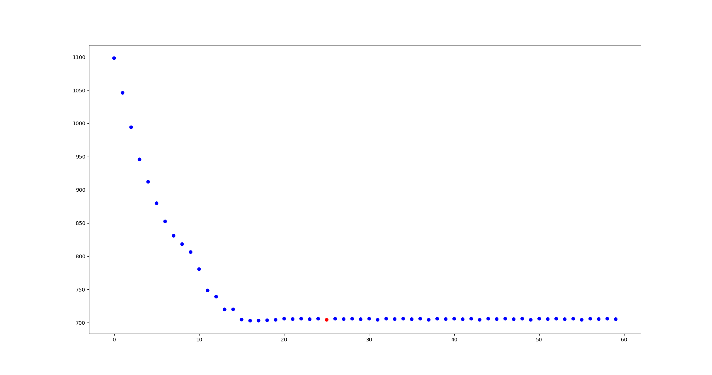
Sur ce graphique, nous voyons où le schéma a été repéré en rouge. Pour voir plus clairement le schéma, voici une version zoomée sur la portion qui nous intéresse :

#### Développement

Pour réaliser cette détection, nous avons d'abord décidé du système suivant :
une liste contient des dictionnaires, qui eux-mêmes stockent en clé la fitness et en valeur la liste tabou convertie en chaîne de caractères. L'idée derrière ce système était que si nous revenions à la même fitness avec la même liste tabou, alors nous serions dans le même état que le début du cycle, et donc que nous aurions tourner en boucle. Toute cette idée repose sur le fait que la fitness est unique pour chaque solution. Or, nous nous sommes rendu compte que ce n'était pas le cas et que deux solutions pouvaient avoir la même fitness. Ainsi, nous avons donc développé une fonctione de hashage de la solution qui nous permet d'avoir une clé réellement unique et de rendre cette détection de schéma fonctionnelle.

#### Analyse des résultats liés

Cette fonctionnalité nous a ammené à la métrique suivante : le nombre d'itérations réelles (en opposition avec le nombre d'itérations prévues au départ). Dans la suite du rapport, nous noterons les itérations réelles avec la notation IR et le nombre d'itérations prévues avec la notation IP.

Nous pouvons remarquer un fait intéressant sur cette donnée. Dans le fichier des moyennes, nous remarquons d'abord que pour le hill climbing (càd taille tabou = 0), le nombre d'IR est globalement toujours le même, et toujours inférieur au nombre d'IP (environ 23 IR). Cela est assez simplement interpretable : le hill climbing converge aux alentours de ce nombre d'itérations. Ainsi, nous pouvons déduire que le bon hyperparamètre pour le hill climbing est de 23 itérations.

Pour revenir au tabou, nous pouvons voir sur ce graphique que l'IR évolue en fonction de la taille de la liste. 
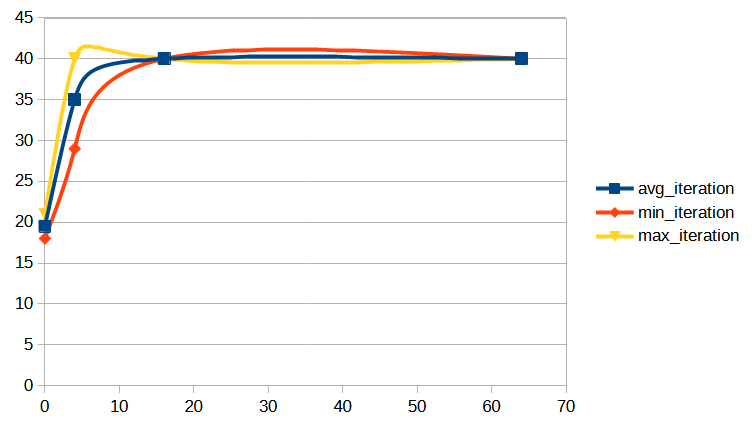
Nous pouvons interpreter cela ainsi : plus la liste est grande, moins vite nous tomberons sur un cycle. Ainsi, la taille de la liste à une influence sur le niveau d'exploration. Nous reviendrons sur cette notion dans la partie "Lien entre les choix d'opérateurs et les autres variables"

### Analyse des utilisation des opérateurs

Comme dit précedement, nous avons décidé d'utiliser les opérateurs relocate et 2-opt. Ainsi, une métrique intéressante est la proportion de choix de chacun de ces opérateurs. 
En regardant la matrice de corrélation, nous pouvons observer un fort lien entre la proportion de 2-opt et le nombre d'IR et d'IP (0.48 et 0.86)
Nous pouvons ainsi observer une évolution de la proportion de 2-opt en fonction du nombre d'IP et de la taille de la liste sur ce graphique :
évolution de la proportion de 2-opt en fonction de la taille de la liste (abscisse : nb d'itération, ordonnée : proportion, les courbes représentent les différentes taille de liste)

Notre interpretation de cette relation entre augmentation de la taille de la liste et augmentation du pourcentage de 2-opt est que, lorsqu'on effectue beaucoup d'itérations, les bonnes solutions du relocate sont dans la liste, donc impossible de les séléctionner. Cela se confirme si nous regardons ce graphique. En effet, nous voyons que pour un même nombre d'itérations, la proportion de 2-opt est plus grande. Ainsi, nous pouvons penser que toutes les bonnes solutions de relocate ont été séléctionnées et mise dans la liste, laissant plus de place au deuxième opérateur.

#### Lien entre les choix d'opérateurs et les autres variables

##### Lien avec le nombre de camions

Dans la matrice de correlation, nous pouvons également voir que le choix de l'opérateur relocate est très fortement corrélé avec le nombre de camions enlevés (0.96). 
Cette correlation est logique, le relocate étant le seul opérateur pouvant enlevé un camion.  

##### Lien avec l'exploration

Une autre relation très marquée est celle entre le choix de l'opérateur relocate et la fitness. En effet, nous pouvont voir une relation corellée dans le négatif (-0.97). Ainsi, quand la proportion de relocate augmente, la fitness diminue. Cette corrélation est liée à celle interprétée dans la partie précendente. En effet, la proportion de relocate diminue lorsque celle de 2-opt augmente. Or, la proportion de 2-opt augmente lorsque l'algorithme a le temps et la place de mettre les très bons voisins dans la liste. Ainsi, la proportion de 2-opt reflète le niveau d'exploration qui a été réalisé. Logiquement, plus l'exploration augmente, plus il y a d'opportunité de trouver une solution possédant une bonne fitness. Cette hypothèse se confirme grâce à une autre corrélation : celle entre la durée moyenne et la proportion de 2-opt (0.86). En effet, une durée plus haute nous indique une exploration plus profonde.

### Analyse de la fitness

Nous allons maintenant voir quelles variables sont en lien avec la fitness de la solution finale.

#### Lien avec le nombre de camions

Nous pouvons d'abord constater un lien très fort entre le nombre de camions de la solution finale et sa fitness (-0.99). En parallèle, nous pouvons également voir la même relation entre le nombre de camions enlevés et la fitness (0.99). Cette relation s'explique intuitivement par le fait que les meilleures solutions ont, en général, moins de camions que les solutions générées aléatoirement.

#### Lien avec le nombre d'IR

Nous pouvons ensuite voir un lien fort (mais toutefois moins que celui précedemment évoqué) entre la fitness et le nombre d'IR (-0.48). Ce lien nous montre que plus on réalise d'itérations, moins la fitness sera haute (et donc meilleure sera la solution). Encore une fois, ce résultat est assez intuitif et ne nécessite pas une plus grande analyse.

### Comparaison tabou / hill climbing

Comme dit précedement, le choix des hyper-paramètres (0, x) nous permettent d'avoir les résultats du hill climbing. Ainsi, nous allons comparer ces résultats avec ceux du tabou afin de voir si la mise en place d'une liste tabou à un impact notable.

#### Qualité

Nous allons réutiliser notre ratio précedent afin de comparer les qualités entre les deux algorithmes. Nous pouvons voir dans l'annexe *quality.csv* que, pour les couples (0, x) la qualité est globalement constante pour 40, 160 et 640 IP. Cette valeur semble cohérente avec notre analyse précédente : l'algorithme converge rapidement et le nombre d'IP n'a donc que peu d'influence une fois cette converge passée. 

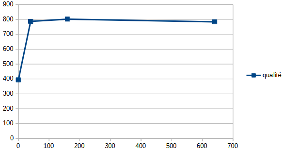
Nous pouvons voir ce phénomène sur ce graphique (qui représente en ordronnée la qualité et en abscisse le nombre d'itérations pour le hill climbing)

La meilleure qualité est de 802. 

Pour le tabou, nous voyons des résultats plus disparatre de qualité. Nous voyons bien l'importance de la notion de temps dans la formule, car les scores de qualité ne sont pas beaucoup plus élevés que pour le hill climbing. Le score maximum, comme vu précedemment, est de 830. Toutefois, si on ne regarde que la fitness, les scores sont encore plus avantageux en faveur du tabou, avec une meilleure fitness à 578 contre 617 pour le hill climbing.  

Ainsi, la méthode tabou est plus avantagueuse que le hill climbing sur le plan de la fitness. Toutefois, le temps passé à faire tourner l'algorithme peut faire pencher la balance du côté du hill climbing si les ressources et le temps disponible ne sont pas très élevés.

### Limites du tabou

La principale limite de l'algorithme tabou est la quantité de voisins à générer. En effet, à chaque itération, tous les voisins possibles avec les opérateurs choisis sont générés.  

Cette croissance peut nous pousser à limiter les opérateurs afin de limiter le nombre de voisins. 
De plus, une autre limite est le choix des opérateurs. En effet, comme vu précédemment, il n'est pas possible de choisir deux opérateurs qui ont une intersection non-nulle.  

Une autre limite du tabou est la vision court terme. En effet, la décision de la solution choisie se base exclusivement sur sa fitness. Or, il serait pertinent que le choix se base plutôt sur la potentielle fitness que cette solution apportera dans le futur. Ce manque de vision long terme se reflète à travers le nombre de camions. En effet, nous avons remarqué que l'algorithme trouvait parfois des solutions non optimales et si retrouvait bloqué. Dans les fichiers de 30 éléments, nous avons par exemple remarqué qu'il s'arretait parfois alors qu'il restait un camion en trop par rapport à la solution optimale. La solution avec le camion en trop possédait une très bonne fitness, mais il était parfois impossible de sortir de ce minimum local et d'explorer jusqu'à enlever la route en trop. Nous pourrions penser que ce problème est mitigé par la liste, qui permet une certaine exploration. Cela est en partie vrai, mais pas totalement. En effet, il est possible que l'algorithme suive une direction d'exploration complètement opposée à la solution optimale globale, et donc qu'il ne découvre jamais l'opportunité d'enlever le camion (bien qu'une liste plus grande permet une plus grande exploration).

### Solutions éventuelles

Nous avons réfléchi à plusieurs solutions pouvant pallier à certains des problèmes évoqués. Par exemple, nous savons que l'algorithme pourrait sauvegarder les fitness de voisins et les mettre à jour plutôt qu'effectuer des calculs inutiles. Ces solutions n'ont malheureusement pas eu le temps de voir le jour et resteront seulement à l'état de prototype, n'ayant ainsi pas servi à la génération des données.

### Difficultés rencontrés

Durant le développement de cet algorithme, nous nous sommes heurté à de nombreuses difficultés

#### Le stockage dans la liste

Notre principale difficulté a été le stockage dans la liste tabou. En effet, dans notre première version, nous stockions l'action que nous venions d'effectuer. Cette interprétation de l'algorithme n'était pas la bonne. En effet, il faut stocker dans la liste l'action qui nous permettrait de revenir à l'état dans lequel nous étions précedemment. Cela s'est révélé assez simple pour le 2-opt, car les actions sont reversibles. Mais la difficulté a résidé dans le relocate. En effet, trouver l'action inverse d'un déplacement d'un client dans une autre route est une tâche plus compliquée. Ne voyant pas comment la réaliser, nous avons commencé le développement de l'algorithme hill climbing et avons décidé de nous contenter de cette méta-heuristique. Mais nous avons fini par trouver la solution pour pouvoir implémenter le tabou correctement et avons pu terminer les développements de l'algorithme. 

#### Temps de génération

Une autre difficulté est apparue lorsqu'il a fallu générer les données. En effet, l'algorithme étant très lent pour les gros jeux de données, et en étant limité par le langage python, nous n'avons pas pu effectuer toutes les exécutions que nous aurions voulues pour avoir une analyse plus poussée (nous aurions pu, si nous avions fait plus d'exécutions pour le même couple, analyser les quartiles et la médiane par exemple, au lieu de se limiter à la moyenne).

## Tabou vs Recuit simulé

### Comparaison sur les trente clients du fichier 101

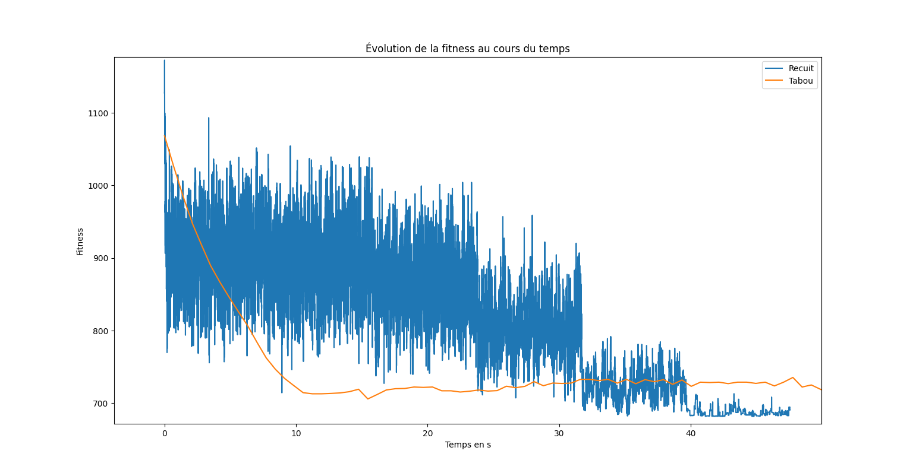

Le premier élément que nous pouvons voir sur ce graphique est la différence de vitesse de convergence entre les deux algorithmes. En effet, nous voyons au bout de 10 secondes un écart de fitness commençant à se créer. L'écart se réduit par la suite car la fitness du tabou se stabilise autour d'environ 720.  

Nous pouvons également constater que le temps d'exécution du tabou est beaucoup plus long. En effet, nous avons zoomé sur la partie intéressante du graphique pour mieux visualiser les deux courbes mais la courbe du tabou s'étend en réalité beaucoup plus loin (175 secondes).  

Enfin, nous pouvons comparer les fitness des meilleures solutions obtenues avec les deux algorithmes. Celle du recuit est de 682.05 et celle du tabou de 705.93. Nous voyons donc un avantage notable du recuit sur cette itération particulière. Cette différence s'explique pour les mêmes raison que celles evoquées dans la partie "Limites du tabou" (difficulté à explorer en dehors d'un minimum locale lorsqu'il faut trop d'itérations pour en sortir).  

### Comparaison sur tous les clients du fichier 101

 
Nous voyons que, pour les 100 clients, les courbes des deux algorithmes sont difficilement exploitables. En effet, le tabou prend beaucoup plus de temps d'exécution pour une itération que le recuit, ce qui empêche d'être dans des échelles cohérentes pour comparer. Nous voyons toutefois sur cette courbe une différence notable entre la fitness minimum atteinte par les deux algorithmes de recuit et celle du tabou. En effet, les recuit donnent des minimums autour de 1600 (respectivement pour le classique et le granulaire 1644.04 et 1683.85). Encore une fois, cela reflète le manque de capacité du tabou à aller explorer loin du son minimum locale et donc potentiellement à laisser des camions superflus. Nous voyons également que le tabou converge moins vite (en terme de temps, pas de nombre d'itérations) car une itération prend beaucoup plus de temps à être exécutée. Si nous remplaçons l'échelle de temps par le nombre d'itérations, nous obtenons ce graphique, qui nous montre que la convergence du tabou en terme de nombre d'itérations reste meilleure.
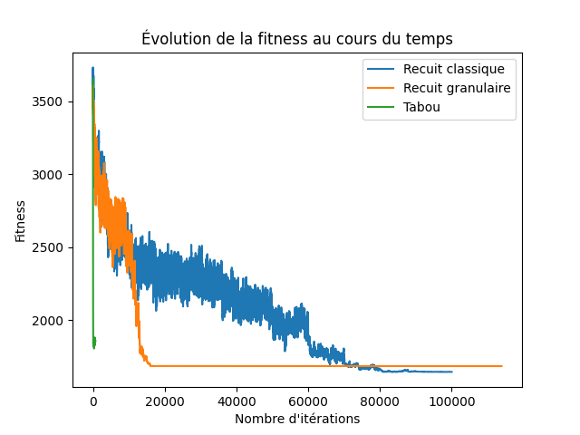

## Conclusion  

Nous avons donc pu observer le résultat de deux méta-heuristiques implémentées en Python : Recuit Simulé et Tabou Search. Ces deux implémentations avaient pour objectif de répondre au problème VRPTW. L'analyse a été effectuée en faisant varier plusieurs paramètres pour comparer les deux heuristiques, le nombre de clients en entrée ainsi que les clients eux-mêmes, traduits par plusieurs fichiers de trente et cent clients. Nous en resortons que Tabou est plus efficace sur un petit jeu de données mais peine à suivre le rythme quand ce même jeu augmente et laisse le Recuit donner de meilleurs résultats plus rapidement.  

En complément de ce rapport, vous pourrez trouver à ce lien le repository git du projet : [lien repository](https://github.com/NicolasGuruphat/VRPTW)