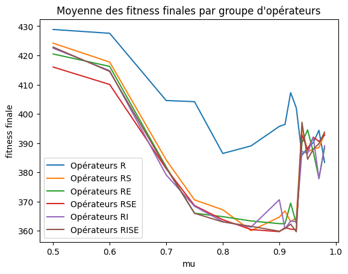
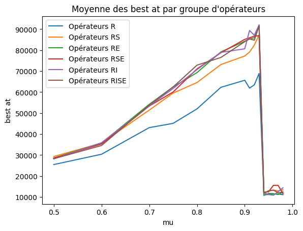
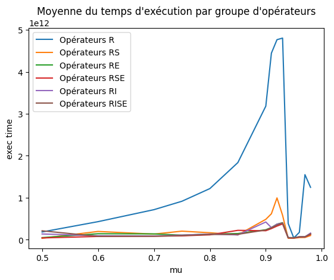
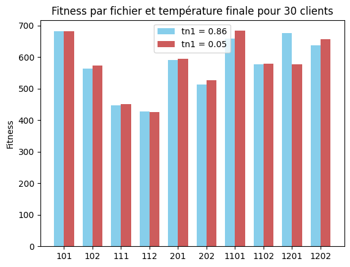
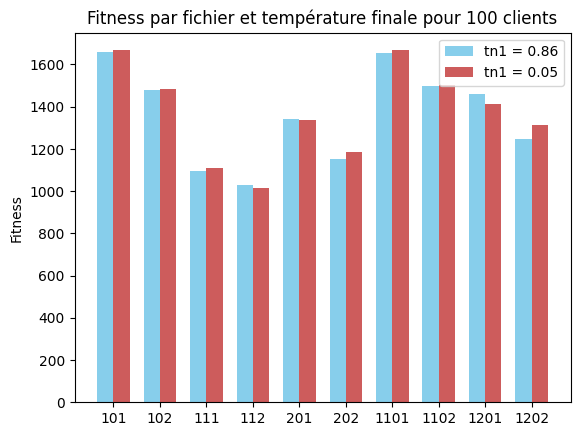
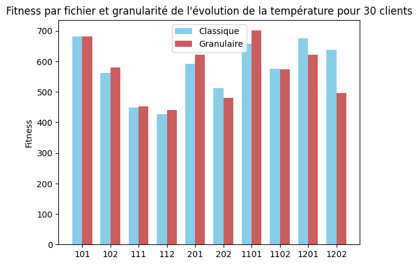
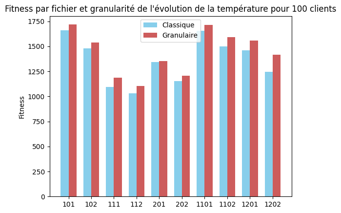
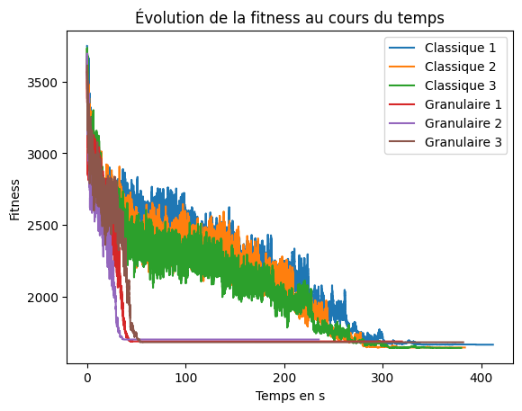

### Avant propos

Les données qui ont servi l'analyse du recuit simulé ont été récoltées sur des ordinateurs différents, les temps d'exécution récoltés ne partagent donc pas tous le même référentiel matériel.  
L'ensemble des simulations a été faite à partir du produit cartésien de ces différents ensembles de valeurs pour les différents hyper-paramètres :  
- $\mu : \{0.5,0.6,0.7,0.75,0.8,0.85,0.9,0.91,0.92,0.93,0.94,0.95,0.96,0.97,0.98\}$
- opérateurs de voisinage utilisés : {Relocate, Relocate + Exchange, Relocate + Cross-Exchange, Relocate + Exchange + Cross-Exchange, Relocate + Reverse, Relocate + Exchange + Cross-Exchange + Reverse}
- $$n_2 : \begin{cases} 10000,& si \space \mu \in \{0.5,0.6,0.7,0.75,0.8,0.85,0.9,0.91,0.92,0.93\} \\ 1000,& si \space \mu \in \{0.94,0.95,0.96,0.97,0.98\} \end{cases}$$
- $t_0 : \{3,4,5,6,7,8,9,10,15,20,25,30,40,50,60,70,80,90,100,150,200,300,400,500,1000\}$  

Pour des raisons logistiques (principalement de temps), seul une itération a été effectuée pour chaque combinaison d'hyper-paramètres, hormi pour $\mu = 0.5$ mais cela sera ignoré. $n_2$ a également été réduit pour des valeurs de $\mu$ élevées car le temps d'exécution devenait trop important ($n_1 = 149$ pour $\mu = 0.98$)  
Les simulations ont été effectuées à partir d'une solution aléatoire non-optimisée. La solution aléatoire donne la priorité aux clients qui attendent d'être livrés et ne se rend chez un client qui n'est pas encore prêt pour attendre uniquement s'il n'y a plus de clients en attente.

### Mise en place

Dans un premier temps le recuit simulé a été appliqué aux trente premiers clients du fichier `data_101.vrp` sans tenir compte des fenêtres de temps. La fonction de fitness a été choisie comme la somme des distances parcourues par les camions. Dans une perspective de valoriser un plus faible nombre de camion, une fonction de fitness integrant une pénalité pour chaque camion et une pénalité pour les camions avec trop de paquets restant a été expérimenter sans que cela n'apporte de bénéfice aux résultats car la distance à elle-seule pénalise les camions superflus à travers l'allé retour à l'entrepot qui en découle.  
Parmis les opérateurs de voisinage implémentables, seuls Relocate (inter et intra), Exchange (inter et intra), Cross-Exchange (intra) et Reverse (inter) ont été choisis. Parmis ces derniers l'usage d'un opérateur permettant de vider une route est important car la solution aléatoire initiale peut comporter des véhicules dispensables qui devront être supprimés pour se rapprocher d'une solution la plus optimale possible.  

### Influence et synergie des hyper-paramètres

L'objectif ultime serait de trouver une combinaison d'hyper-paramètres qui donne une bonne solution (de préférence une optimale) dans un temps le plus court possible. Pour cela, il serait intéressant de chercher combien de tours de recuit sont nécessaires pour atteindre notre objectif et surtout, comment déterminer cette valeur en fonction de la taille du jeu de données. Nous nous intéresserons donc à deux axes :
- Un $\mu$ grand (proche de 1) avec un $n_2$ petit
- Un $\mu$ petit (proche de 0.5 car 0 est trop faible) avec un $n_2$ grand

La principale différence entre ces deux cas est qu'avec un $\mu$ grand, les $n_1$ itérations auront des températures similaires d'un tour à l'autre alors que pour un $\mu$ faible, la température va drastiquement changée mais sur un moins grand nombre d'itérations (car $n_1$ sera plus petit car dépendant de $\mu$).  

Nous avons donc cherché quels hyper-paramètres influaient le plus sur la qualité de la solution. Nous avons pour cela utilisé une matrice de corrélation (cours d'Analyse des Données Multidimensionnelles qui nous est dispensé durant le S8). Cela nous a permis d'obtenir ceci :

$ \begin{pmatrix}
1.00 & 0.00 & -0.00 & 0.00 & -0.02 & -0.25 & -0.03 & 0.01 & 0.10 \\
0.00 & 1.00 & 0.00 & 1.00 & -0.00 & 0.35 & 0.32 & 0.12 & -0.04 \\
-0.00 & 0.00 & 1.00 & 0.00 & 0.01 & -0.12 & 0.08 & -0.38 & -0.31 \\
0.00 & 1.00 & 0.00 & 1.00 & -0.00 & 0.35 & 0.32 & 0.12 & -0.04 \\
-0.02 & -0.00 & 0.01 & -0.00 & 1.00 & -0.02 & 0.01 & 0.00 & -0.03 \\
-0.25 & 0.35 & -0.12 & 0.35 & -0.02 & 1.00 & -0.19 & 0.37 & 0.12 \\
-0.03 & 0.32 & 0.08 & 0.32 & 0.01 & -0.19 & 1.00 & -0.17 & 0.05 \\
0.01 & 0.12 & -0.38 & 0.12 & 0.00 & 0.37 & -0.17 & 1.00 & -0.03 \\
0.10 & -0.04 & -0.31 & -0.04 & -0.03 & 0.12 & 0.05 & -0.03 & 1.00 
\end{pmatrix}  $

avec, dans l'ordre : $mu$, la température finale, les opérateurs utilisés, la température initiale, la fitness initiale, la fitness finale, le nombre d'itérations avant d'atteindre le meilleur minimum calculé, le nombre de camions en sortie, le temps d'exécution.

On peut en extraire quelques valeurs :
- 0.35 : la corrélation entre la température finale et la fitness finale
- 0.32 : la température finale et le nombre d'itérations avant le meilleur minimum
- -0.38 : les opérateurs utilisés et le nombre de camions
- -0.31 : les opérateurs utilisés et le temps d'exécution
- 0.35 : la température intiale et la fitness finale
- 0.32 : la température initiale et le nombre d'itérations avant le meilleur minimum
- 0.37 : la fitness finale et le nombre de camions

Certains critères ne sont pas à leur avantage à cause de la façon dont les données ont été générées. Par exemple la température initiale qui est aléatoire ne peut pas être correctement corrélée à un autre critère avec des hyper-paramètres changeant à chaque itération.  
Le plus intéressant est d'observer la température finale (et intiale car $t_{n1} = \mu^{n_1}\times t_0$), on en déduit donc qu'en déterminant la plage de températures finales qui donnent une solution optimale, on peut déterminer le $\mu$ adéquat.  
La corrélation entre les opérateurs utilisés et le nombre de camions a un sens puisque la capacité à vider une route dépend des opérateurs et influe sur le nombre de camions.  
Les opérateurs utilisés et le temps d'exécution est aussi logique car certains opérateurs sont plus gourmands en temps processeur (cross-exchange par exemple). L'objectif seront donc de trouver le groupe d'opérateurs demandant le moins de temps mais permettant de réduire le nombre de camions.  
Nous avons également expliqué que la fitness était intrinsèquement reliée aux nombres de camions, il est donc logique de voir ces derniers corrélés.  
Toutes les corrélations abordées ci-dessus étaient cohérentes et/ou attendues. Cependant, le fait que la température finale/initiale soit corrélée au nombre d'itérations avant le meilleur minimum, et cela avec le même signe (positif) que la température et la fitness, est très intéressant car on peut donc espérer avoir une bonne solution avec un nombre d'itérations limitées !

Nous allons donc nous intéressé à quelques unes de ces corrélations.

#### Température finale et fitness finale

À partir des données récoltées, en récupérant toutes les températures finales qui ont donné une solution optimale pour le jeu de données d'entrée. On en déduit qu'en moyenne $t_{n1} = 0.8624991157717019$ donne de bons résultats. Il est intéressant de noter que la température finale maximale donnant une solution optimale croît avec $\mu$, par exemple, elle est de :

| $\mu$ | $max(t_{n1})$ tel que $x$ est une solution optimale avec $x$ résultat du recuit simulé |
|---|---|
| 0.5 | 0.14536501951208458 |
| 0.6 | 0.1938200260161128 |
| 0.7 | 4.845500650402822 |
| 0.75 | 14.536501951208459 |
| 0.8 | 48.45500650402821 |
| 0.85 | 48.4550065040282 |
| 0.9 | 48.455006504028226 |
| 0.91 | 48.45500650402821 |
| 0.92 | 48.45500650402819 |
| 0.93 | 48.455006504028205 |
| 0.94 | 24.22750325201411 |
| 0.95 | 14.536501951208459 |
| 0.96 | 7.268250975604232 |
| 0.97 | 24.227503252014102 |
| 0.98 | 2.9073003902416916 |

Il subsiste tout de même un biais qui est la qualité de la solution aléatoire qui peut influer sur la qualité de la solution en sortie, de ce fait, le tableau ci-dessus n'est qu'une possibilité et l'aléatoire du recuit simulé (choix du voisin) combiné à la qualité aléatoire de la solution initiale aurait très bien pu produire $t_{n1} = 100$ pour $\mu = 0.9$ par exemple.

Nous noterons également que la corrélation entre la température finale et la fitness finale est très importante pour les $\mu$ petits jusqu'au passage de 0.75 à 0.85 où la corrélation passe de 0.63 à 0.15. La corrélation pour $\mu = 0.5$  et $\mu = 0.6$ sont respectivement de 0.86 et 0.88, élément important car si l'objectif est d'arriver à une température finale inférieure à 1 avec une température intiale calculée, plus le jeu de données en entrée sera grand, plus la température intiale risque d'être élevée et donc plus $\mu$ devra s'éloigner de 1 ($t_{n1}=\mu^{n1}\times t_0$). En combinant ces deux aspects, on peut aisément supposer que travailler avec des $\mu$ petits présente un intérêt.

Nous allons donc chercher à calculer $\mu$ en fonction de $t_{n1}$ et $t_0$ :
$$
t_{n1} = \mu^{n1} \times t_0
\newline \Leftrightarrow

t_{n1} = \mu^{\frac{\ln(\frac{\ln(0.8)}{\ln(0.01)})}{\ln(\mu)}} \times t_0
\newline \Leftrightarrow

\ln(t_{n1}) = \ln(\mu^{\frac{\ln(\frac{\ln(0.8)}{\ln(0.01)})}{\ln(\mu)}} \times t_0)
\newline \Leftrightarrow

\ln(t_{n1}) = \ln(\mu^{\frac{\ln(\frac{\ln(0.8)}{\ln(0.01)})}{\ln(\mu)}}) + \ln(t_0)
\newline \Leftrightarrow

\ln(t_{n1}) = \frac{\ln(\frac{\ln(0.8)}{\ln(0.01)})}{\ln(\mu)} \times \ln(\mu) + \ln(t_0)
\newline \Leftrightarrow

\ln(t_{n1}) = \ln(\frac{\ln(0.8)}{\ln(0.01)}) + \ln(t_0)
$$
Nous arrivons donc à une impasse dans ce cas, cela est logique car il existe une infinité de solutions pour $t_{n1} = \mu^{\frac{\ln(\frac{\ln(0.8)}{\ln(0.01)})}{\ln(\mu)}} \times t_0$  
Nous allons donc fixer calculer $\mu$ à partir de $t_{n1}$, $t_0$ et $n_1$ :

$$
t_{n_1} = \mu^{n_1} \times t_0
\newline \Leftrightarrow

\ln(t_{n_1}) = \ln(\mu^{n_1} \times t_0)
\newline \Leftrightarrow

\ln(t_{n_1}) = \ln(\mu^{n_1}) + \ln(t_0)
\newline \Leftrightarrow

\ln(t_{n_1}) = n_1 \times \ln(\mu) + \ln(t_0)
\newline \Leftrightarrow

\ln(t_{n_1}) - \ln(t_0) = n_1 \times \ln(\mu) 
\newline \Leftrightarrow

\frac{\ln(t_{n_1}) - \ln(t_0)}{n_1} = \ln(\mu) 
\newline \Leftrightarrow

e^{\frac{\ln(t_{n_1}) - \ln(t_0)}{n_1}} = e^{\ln(\mu)} 
\newline \Leftrightarrow

\mu = e^{\frac{\ln(t_{n_1}) - \ln(t_0)}{n_1}}
$$

Nous avons $t_0 = \frac{-\Delta f}{\ln(0.8)}$ et $t_{n_1} = 0.86$. Reste à déterminer $t_{n_1}$.  
Pour cela, il faudrait trouver une valeur qui dépende de la taille de l'entrée. Plus la taille de l'entrée est grande, plus l'écart entre la fitness de la meilleure solution et celle de la pire est grand ou au moins constant (Raisonnement par l'absurde, si la différence entre la fitness de la meilleure solution et celle de la pire diminuait quand la taille de l'entrée augmente, alors la pire solution serait égale/semblable à la meilleure pour une taille d'entrée $x_{k}$ avec $k \longrightarrow \infty$ **et donc aussi pour $x_{k+1}$ !**. Or cela est vrai pour un et deux clients mais par pour trois alors c'est absurde). $\Delta f$ calculé à partir de solutions aléatoires pourrait donc être une bonne piste, il est, cependant, trop élevé pour être utilisé tel quel. Il existe plusieurs fonctions permettant de réduire cette valeur pour éviter un trop grand nombres d'itérations tout en évitant de trop rapidement converger vers l'infini : racine carrée et logarithme néperien. Nous continuerons donc avec $n_1 = \sqrt{|\Delta f|}$ ou $n_1 = \ln{|\Delta f|}$

Si on implémente cela, dans le cas des trente premiers clients du fichier 101, on constate facilement que $n_1$ est très voire trop petit si calculé avec $ln$ (environ 3-4) et la solution finale peine à avoir une fitness en dessous de 400 alors que l'optimale est d'environ 358 contrairement à $\sqrt{}$, pour laquelle les valeurs de $n_1$ sont plus correctes (6-8) et où l'optimal est parfois atteint (environ une fois sur dix dans le cas présent). On remarque que c'est discutablement efficace pour un petit jeu de données.  
Si on reprend les cent clients du fichier data101, $\Delta f$ est bien évidemment plus élevé et donc $n_1$ aussi. Nous reviendrons sur l'analyse des résultats avec un $\mu$ calculé par la suite.

#### Température finale et nombre d'itérations avant le meilleur minimum

#### Le choix des opérateurs

Intéressons-nous maintenant à la fitness finale en fonction des opérateurs pour pouvoir déterminer quel groupe d'opérateurs pourrait être le plus pertinent.

(R: Relocate, S: Switch, E: Cross-Exchange, I: Reverse)  

On peut voir que Relocate seul n'est pas très efficace pour trouver une bonne solution et que les autres groupes testés restent assez homogènes. Nous allons quand même nous intéresser à deux groupes, RS et RSE. Nous allons ignoré les groupes avec Reverse car il n'améliore pas directement la fitness et est trop difficile à appliquer avec des fenêtres de temps.
- RSE : Très clairement le meilleur avec un $\mu$ faible ( $<0.65$ ), ce qui devrait être notre cas post-analyse. Il se confond avec les autres courbes à mesure que $\mu$ augmente. Le cross-exchange reste cependant plus coûteux en temps et plus la taille des morceaux échangés est grand, moins il a de chance d'être compatible avec les fenêtres de temps.
- RS : Relocate et Switch représentent le compromis entre efficacité (temps d'exécution) et pertinence, même s'il est dans le pire groupe quant à la fitness obtenue, il reste proche du reste du classement. Une bonne alternative pour se permettre de faire quelques tours de boucles supplémentaires si on veut réutiliser le temps économiser par la vitesse d'exécution.

Dans le cadre de la mise en place des fenêtres de temps, nous nous concentrerons donc principalement sur le couple d'opérateurs Relocate Switch.

On peut voir que la vitesse de convergence est inversement porportionelle à la fitness finale. Malgré une fitness finale moins bonne, on pourrait donc envisager l'usage de Relocate comme seul opérateur si on veut une convergence rapide.

Sur ce graphique on peut voir que Relocate seul prend beaucoup de temps, donc malgré une convergence rapide, son exécution est plus longue. Cela motive donc notre choix de rester sur les groupes d'opérateurs Relocate Switch Cross-Exchange et Relocate Switch.

### Mu calculé avec fenêtres de temps, Relocate + Switch vs Relocate + Swich + Cross-Exchange

Nous allons poursuivre l'analyse avec les cent clients du fichiers 101 et les fenêtres de temps.  
La sélection aléatoire d'un voisin implique que l'on doit chercher un voisin valide (qui respecte les contraintes temporelles, de capacité). Ces voisins sont moins nombreux avec les fenêtres de temps et donc la recherche dure plus longtemps. Cela a donc un impacte important que n'a pas un Tabu qui cherche tous les voisins. Mais dans le cas du recuit, les fenêtres de temps signifient aussi un $\Delta f$ plus important donc un $n_1$ calculé plus élevé avec un nombre de solutions valides plus faibles, on devrait donc pouvoir visiter une plus grande proportion de solutions et donc avoir plus de chance de se rapprocher d'un résultat optimal.  

Prenons la moyenne de cinq résultats pour les groupes d'hyperparamètres suivants :

| Hyper paramètres | Moyennes des meilleures fitness observées |
|---|---|
| Relocate + Switch, SQRT | 1660 |
| Relocate + Switch, LN | 1733 |
| Relocate + Switch, 2*SQRT | 1658 |
| Relocate + Switch, 2*LN | 1665 |
| Relocate + Switch + Cross-Exchange, SQRT | 1720 |
| Relocate + Switch + Cross-Exchange, LN | 1858 |
| Relocate + Switch + Cross-Exchange, 2*SQRT | 1821 |
| Relocate + Switch + Cross-Exchange, 2*LN | 1834 |

On voit donc que le couple Relocate + Switch donne de meilleurs résultats, observation que l'on peut appuyer si on jette un oeil à ce tableau mais sur les trente premiers clients seulement avec des conditions similaires (nombre d'exécutions):

| Hyper paramètres | Moyennes des meilleures fitness observées |
|---|---|
| Relocate + Switch, SQRT | 682 |
| Relocate + Switch, LN | 682 |
| Relocate + Switch, 2*SQRT | 682 |
| Relocate + Switch, 2*LN | 682 |
| Relocate + Switch + Cross-Exchange, SQRT | 799 |
| Relocate + Switch + Cross-Exchange, LN | 767 |
| Relocate + Switch + Cross-Exchange, 2*SQRT | 779 |
| Relocate + Switch + Cross-Exchange, 2*LN | 770 |

On remarque que dans le cas présent, sur les vingt recuits effectués avec Relocate + Switch, la solution optimale à été obtenue 19 fois (95%) alors que Relocate + Switch + Cross-Exchange n'a pas atteint l'optimal une seule fois.

#### Convergence

Pour les trente premiers clients du fichier 101 avec les fenêtres de temps, voici un tableau de la moyenne du nombre d'itérations avec de trouver le plus petit minimum en fonction des hyper-paramètres effectuée sur cinq exécutions du recuit :

| Fonction de calcul de $n_1$ \ Opérateurs utilisés | RS | RSE |
|---|---|---|
| SQRT | 61187 sur 88500 | 2399 sur  67000 |
| LN | 33653 sur 41990 | 7203 sur 40000 |
| 2*SQRT | 77919 sur 145000 | 12366 sur 138000 | 
| 2*LN | 61146 sur 83000 | 5113 sur 79000 |

Et pour les cent premiers clients du même fichier :

| Fonction de calcul de $n_1$ \ Opérateurs utilisés | RS | RSE |
|---|---|---|
| SQRT | 90673 sur 110000 | 87769 sur  123000 |
| LN | 42015 sur 50000 | 37759 sur 46000 |
| 2*SQRT | 121919 sur 230000 | 110112 sur 222000 | 
| 2*LN | 85110 sur 100000 | 79245 sur 100000 |

Si on s'intéresse au nombre d'itérations avec l'obtention de la meilleure solution pour l'exécution du recuit, on peut voir que cette valeur est plus ou moins inférieure au nombre total d'itérations (Proche de $best\_at \longrightarrow n_1 \times n_2$ pour $n_1$ calculé avec $\sqrt{}$ alors qu'il est proche de la moitié pour $2\sqrt{}$). Sachant qu'il était difficile d'attendre une bonne valeur pour les trente premiers clients, on peut en déduire que $n_1$ en fonction de la taille de l'entrée croît plus vite que le le nombre d'itérations nécessaires pour obtenir une bonne solution en fonction de cette même taille. On remarque aussi que le nombre d'itérations nécessaires est moins élevé avec Relocate + Switch + Cross-Exchange mais cela car les résultats sont moins bons (cf partie précédente).

Si l'on doit choisir une façon de calculer $n_1$, on va tout d'abord rejeter $\ln$ qui donne des résultats sensiblement moins bons car ne laisse pas la convergence se faire à cause de valeurs trop petites. Les trois autres façons donnent des résultats similaires, il faudrait donc d'autres essais avec des jeux de données plus conséquents pour voir si une différence apparait entre ces derniers mais nous choisirons $\sqrt{}$ pour la suite pour réaliser le reste de l'analyse avec trente ou cent clients.

Essayons maintenant de voir si la température finale $t_{n_1}$ peut avoir un impact intéressant sur la qualité des solutions. Nous avons précédemment déterminé que $t_{n_1} = 0.86$ pouvait être une bonne température finale et que cette même température devait être plutôt basse (voire corrélation ci-dessus). Mais tentons de la réduire, par exemple $t_{n_1} = 0.05$, pour voir si cela peut améliorer la solution :

On observe une forte similitude entre les résultats, on en déduit que les deux températures finales ont un impact similaire sur la qualité de la solution et qu'il n'est pas nécessaire de diminuer $t_{n_1}$ en dessous de $0.86$.

#### Augmenter la granularité de la température

Dans cette partie nous allons essayer de déterminer s'il existe un bénéfice à rendre plus granulaire l'évolution de la température en diminuant $n_2$ et en augmentant $n_1$ ($\div 10$ et $\times 10$ respectivement). Pour ce faire, nous allons comparer une exécution avec $n_1 = \sqrt{|\Delta f|}$ et $n_2 = 10000$ (dénommée classique) avec $n_1 = 10\times \sqrt{|\Delta f|}$ et $n_2 = 1000$ (dénommée granulaire) pour l'ensemble des fichiers de données avec trente et cent clients. Les fitness représentées sont une moyenne sur cinq exécutions :

On peut remarquer que les fitness sont très proches (hormis dans un cas mais l'aspect aléatoire est important avec un nombre d'exéctions aussi "petit"). Dans le cas des cent clients, on observe même que l'exécution classique donne de sensiblement meilleurs résultats. Pour comprendre ce qui pourrait en être la cause, cherchons à analyser l'évolution de la température durant l'exécution :

On peut observer que les recuits exécutés avec une évolution plus granulaire de la température converge radicalement plus vite (très rapidement, trois fois plus rapide). Mais les solutions sont légèrement moins bonnes et cela car la convergence est plus rapide donc moins exploratoire. On peut donc envisager d'utiliser l'une des façons de faire suivant le cas, si on veut un résultat rapide, une granularité forte est plus intéressante au détriment de quelques minutes sur la fitness du résultat.

#### Qualité de la solution

Pour essayer de juger la qualité des résultats du recuit, la fitness est intéressante mais manque d'un référentiel pour passer du quantifiable au qualifiable. Pour la suite, nous travaillerons avec l'ensemble des fichiers de données et avec trente et cent clients ainsi que les fenêtres de temps. Les résultats seront comparés aux résultats gloutons (avec une priorité aux clients directement livrables les plus proches).
Les résultats du recuit sont la moyenne de cinq exécutions :

| Fichier du jeu de données (nombre de clients) | Glouton | Recuit |
|---|---|---|
| 101 (30) | 1089.282448171974 | 682.0534548509409 |
| 102 (30) | 1057.6737806455794 | 562.489530446921 |
| 111 (30) | 922.9133908185511 | 447.8438852063749 |
| 112 (30) | 606.1457655565695 | 426.61303409117215 |
| 201 (30) | 851.094076314574 | 591.2809920884785 |
| 202 (30) | 746.8752190488493 | 512.0894746685451 |
| 1101 (30) | 1180.6508074676167 | 657.8911032719449 |
| 1102 (30) | 1059.5755092274464 | 576.4275152029046 |
| 1201 (30) | 1234.2533327152512 | 676.1370847001465 |
| 1202 (30) | 1030.373582292059 | 637.2148409803067 |
| 101 (100) | 3107.7777100922544 | 1660.761803803932 |
| 102 (100) | 2956.4952202799095 | 1480.0127288033807 |
| 111 (100) | 2081.840103804694 | 1095.1646970808329 |
| 112 (100) | 2076.9618938202198 | 1029.4272261284739 |
| 201 (100) | 2511.9294477406997 | 1341.800344504427 |
| 202 (100) | 2339.502433057424 | 1151.0044957741725 |
| 1101 (100) | 3509.0538453669546 | 1652.9365326292343 |
| 1102 (100) | 3259.497225301454 | 1498.1078117170505 |
| 1201 (100) | 3149.177595442274 | 1457.987890701932 |
| 1202 (100) | 3327.9963142188844 | 1244.7769345543302 |

On peut observer, pour le recuit, une division presque par deux de la fitness du glouton pour une grande partie des cas. Cela montre son utilité surtout avec une pire exécution n'ayant duré qu'environ treize minutes et une moyenne globale de 370 secondes (6min10s) pour les cent clients et de 78 secondes (1min18s) pour les trente premiers clients. 

### Difficultés et axes d'amélioration

Le plus gros frein durant nos expérimentations et notre analyse fut le temps d'exécution et donc le langage utilisé, même si ce choix était déjà controversé avant même le développement, nous avons quand même décidé de conserver le langage Python pour être certain de mener à bien le développement même si cela impactait négativement le temps nécessaire pour la génération de données.  
Ce manque de temps qui en a résulté a donné lieu a un second obstacle, la quantité de données générées n'étaient pas assez importante pour pouvoir correctement illustrer des hypothèses ou interpréter les résultats avec le bon recul (par exemple une exécution pour un groupe d'hyper-paramètres n'est pas assez).  
Nous avons également rencontré un problème avec $\mu = 0.99$ qui créait parfois une erreur (qui n'était pas forcément la même à chaque fois) lors de l'exécution du recuit, le problème racine n'étant pas flagrant, nous n'avons pas prioriser ce fait et avons préféré privilégier la suite de l'analyse.  
Une optimisation/amélioration du code serait également pertinente pour éviter les nombreux cas où le recuit fonctionnait sur un temps anormal (plus d'un quart d'heure pour la sélection d'un voisin), pour régler cela, nous avons mis en place une durée maximale (trois minutes) pour la sélection du voisin aléatoire et du tour de boucle $n_1$ (donc les $n_2$ itérations).

### Conclusion

Nous avons donc pu voir à quel point les hyper-paramètres utilisés sont importants pour avoir un recuit simulé efficace et pertinent. Nous avons, par la même occasion, exploré la possibilité de calculer $n_1$ et $\mu$ de sorte à s'adapter à la taille du jeu de données et découvrant le lien entre la qualité d'une solution et la température finale, cela a permis de calculer un bon groupe d'hyper-paramètres dynamiquement pour s'adapter au jeu de données en entrée et à la fitness de la solution aléatoire initiale. En sont ressortis que les opérateurs Relocate + Switch étaient un bon compromis entre efficacité et pertinence, combinés à $n_1=\sqrt{|\Delta f|}$, $n_2 = 10000$, $\mu = e^{\frac{\ln(t_{n_1}) - \ln(t_0)}{n_1}}$, $t_{n_1}=0.86$. Cependant, dans le cas où l'on voudrait de bons résultats rapidement, on peut mutliplier $n_1$ par dix et diviser $n_2$ par dix (pour compenser). Pour pousser et améliorer la qualité de ces paramètres, il serait intéressant de les utiliser sur des jeux de données plus conséquents.